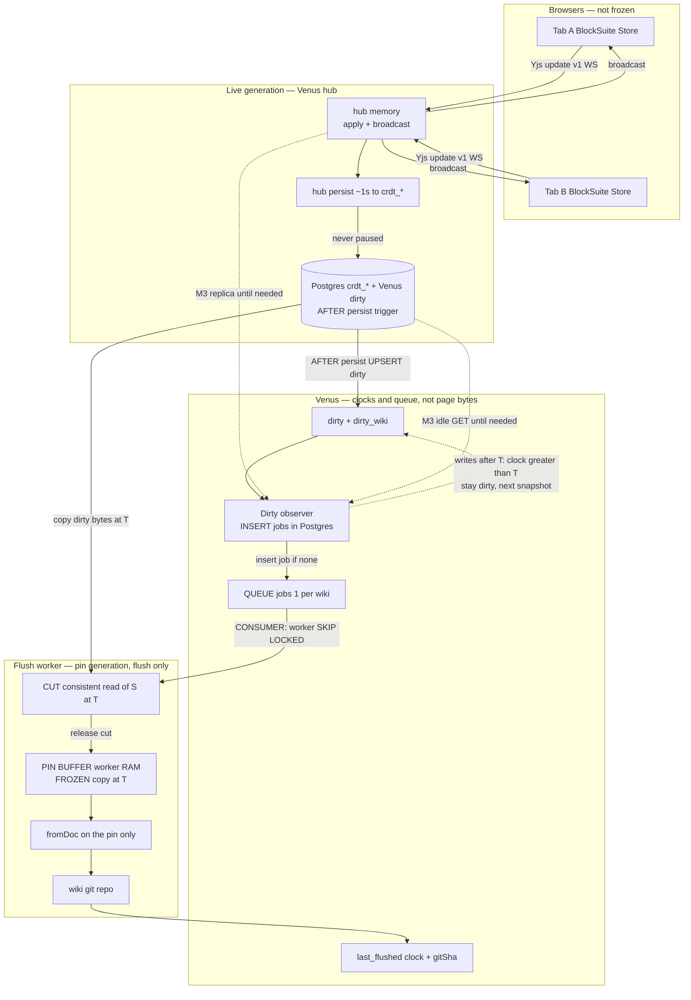

# High-load / high-availability snapshotter

**Status:** revised 2026-09-01 — **re-accept before M3 code.** Live CRDT is the **Venus hub** after [M3.0](../M3.0/README.md) (keck does not stay). **Dirty:** Postgres upsert on hub persist (`crdt_update`). **Jobs:** Venus `jobs` table (observer `INSERT…SELECT` in Postgres), not Akka/Kafka/Redis. Consumers: **TTL lease** on that row, not a held `FOR UPDATE`. Pin starts at **claim**. Pin rules: [README.md](./README.md). Hub fleet: [M3.0/high-availability.md](../M3.0/high-availability.md). Convert: [pin-convert.md](../MDGate/pin-convert.md). Git tree: [datamodel — git](../datamodel/git.md). Milestone: [implementation plan — M3](../venus-implementation-plan.md#m3--git-snapshotter-week). **Do not start M3 while M3.0 is open.**

2026-08-31 morning “OctoBase stays / keck dirty notify” is **superseded**. Invariants 1–8 (live never waits, two buffers, queue, cut then convert) are unchanged; item 9 is hub not keck. **2026-09-01:** wiki-grain enqueue, bulk `jobs` insert, no broker; consumer **TTL lease** (not held `FOR UPDATE`); pin starts at **claim**, persist never queued. Revising this file **re-opens the M3 gate** — stop M3 implementation until this revision is accepted **and M3.0 is closed**.

M3 is **one** workspace and **one** page. This file is the scale contract so that slice does not paint “one replica + GET export in one process” into a corner. The invariant does not change: live collaboration never waits on markdown, git, or convert.

## Load

| | Target |
|---|---|
| Product workspaces (wikis) | Thousands typical; enqueue must not break at **10⁴–10⁵ dirty wikis** |
| Pages per wiki | Hundreds |
| Edits | Many pages, many wikis, in parallel |
| Snapshotter | A **fleet**, not one process |

A hidden AFFiNE client **per page** (or per wiki) does not survive this. Neither does one global `wiki/` git index, nor `fromDoc` of a live browser `Store`.

## What this is not

- Not convert or git inside the **hub**. Sidecar **beside** persist. **M3.0 hub** is the collab process (keck is M1 legacy). Dirty is a **Postgres upsert** when `crdt_update` lands ([M3.0 HA — dirty](../M3.0/high-availability.md#dirty-mark-postgres-not-a-hub-hook)).
- Not an exclusive `LOCK` of a workspace (or of dirty pages) for the duration of convert / `git commit`. That stalls the people typing.
- Not a log of every CRDT op. Git dirty unit is still the **page**.
- Not markdown in Postgres. Pins are short-lived copies. Durable Venus state is **clocks + dirty set + jobs**.

## Units

| Unit | Role |
|---|---|
| **Wiki** (`workspace_id`) | One git repository. One flush job at a time. Idle timer. |
| **Page** (`docId`) | One `.md`. Dirty / pin / convert grain. |
| **Blob** | Dirty with the page that references it (or its own clock). Copied only if dirty. |
| **Catalog** | Pinned in the same **cut** as the dirty pages so `gitPath` matches the files. |

At this load: **one git repo per wiki**. A single working tree cannot take thousands of parallel commits. M3 may still use one `wiki/` because there is one workspace.

## Two buffers

When a flush job hits a wiki, there are two buffers. They are not the same memory.

```text
live generation (always)          pin generation (flush only)
browsers → hub apply/broadcast    copy of dirty docs at cut clock T
         → persist (never paused) held in the worker until commit
         → new writes after T     convert + git run on this copy
           stay on the dirty list
```

**Live keeps living** for the whole pin + convert. Clients do not freeze. Hub apply/broadcast does not stop. Persist of **other** pages never stops. Persist of **dirty** pages must also continue: new bytes after T are the **next** snapshot, not a blocked writer.

The pin buffer is the worker’s `Map<docId, { bytes, clock }>`. Crash it and the next job retries. Git HEAD is the last successful commit. Do not durable-write the pin except lease `T0` ([README — where the pin lives](./README.md#where-the-pin-lives)).

### Where each thing lives

Two **buffers** (bytes of pages). Everything else is clocks, jobs, or git — not a third CRDT.

| Thing | What it holds | Where it lives | Who writes it | Frozen? | Durable? |
|---|---|---|---|---|---|
| **Live generation** | Current CRDT of every page | Hub **memory** (apply/broadcast) + **Postgres** `crdt_*` / blobs after the ~1s persist batch | Browsers → WS → hub. Persist thread drains to SQL. Never Venus markdown. | **No.** Typing continues for the whole flush. | Postgres is the refresh truth. Hub RAM can trail SQL by ~1s. |
| **Pin generation** | Copy of **dirty** pages only, at cut clock **T** | Flush **worker RAM**: `Map<docId, { bytes, clock }>` (spill to worker disk if huge) | Worker copies from persist at the cut (cloud: MVCC `SELECT` of dirty rows; M3: replica encode or idle `GET …/export`) | **Yes — this copy only.** Bytes and clocks in the Map do not change until drop. | **No**, except this flush is lease `T0` (keep until the lease ends). Crash → retry from `dirty`. |
| **Dirty / jobs / last_flushed** | Clocks and job rows, **not** Yjs bytes | **Venus tables** (same Postgres instance as `crdt_*` is the hosted default) | **Persist path in Postgres** upserts `dirty` / `dirty_wiki` when `crdt_update` rows land (trigger). Observer `INSERT…SELECT`s `jobs` (not a broker). Workers consume. Step 12 writes `last_flushed`. The hub does not write `jobs`. | Job row is the **wiki flush lock** (one inflight). CRDT rows are not locked. | **Yes.** This is HA state. |
| **Git `wiki/`** | Markdown + sidecar + dirty blobs **after** convert | One repo **per wiki** (M3: one `wiki/`) | Convert worker: `fromDoc` on the **pin**, then `git add` / `git mv` / one commit | HEAD is last **successful** commit. Convert does not mutate live CRDT. | **Yes** (git remote). |
| **Cut** | A consistent **read** of dirty set **S** at **T** | DB snapshot or generation **G** for the copy window only | Worker opens it, copies S into the pin Map, **drops it** before `fromDoc` | Brief. Not a writer freeze. Not held across convert or `git commit`. | No. |

The hub persist buffer (~1s) is **live generation**, always on. It is not the Venus pin. Do not pause it ([M3.0 HA](../M3.0/high-availability.md)). M1 keck `save_update` is the same idea, legacy: [octobase.md](./octobase.md).

### Full data flow

```text
1. Type     browser Store / Y.Doc
2. Sync     Yjs update v1 → hub apply + broadcast (other tabs live)
3. Persist  hub persist ~1s → Postgres crdt_update   ← never paused
4. Dirty    same Postgres: AFTER persist upsert dirty[workspace_id, docId].clock
            and dirty_wiki[workspace_id] (SQL trigger; hub does not write jobs)
5. Queue    observer INSERT…SELECT jobs in Postgres; worker consumes (`SKIP LOCKED`)
6. Claim    worker: short `SKIP LOCKED` + set `owner` / `lease_until`; **COMMIT**
7. Cut      consistent read of S at T; live writers append the next version
8. Pin      copy S bytes into **this consumer’s** Map  (pin generation starts here — not at enqueue)
9. Release  drop the DB snapshot / generation G   ← convert must not hold this
10. Convert fromPinnedBytes / pinThenFromDoc on the Map only
11. Git     one commit on this wiki’s repo
12. Clocks  last_flushed[docId] = T
            if dirty.clock > T → page stays dirty → enqueue again
13. Drop    pin Map (keep if lease T0)
```

Writes after **T** never join this commit. They stay on live generation (hub + Postgres) and on `dirty`. The next job pins a **new** generation.

Nothing in steps 10–11 talks to the hub. Clients do not freeze. Pages not in **S** are not read.

### Dataflow (two buffers)

Scale shape. M3 may thin every box. Must not invert: live never waits on the pin; convert never reads the live `Store`. Dirty upsert must not stall persist. The hub does not write `jobs`.



**Hub persist writes `crdt_*` only** (never paused). **Dirty** is a second table in the **same Postgres**: a tiny `AFTER INSERT/UPDATE` on persist rows upserts `dirty(workspace_id, docId, clock)`. No hub hook unless that map is impossible. [M3.0 HA — dirty](../M3.0/high-availability.md#dirty-mark-postgres-not-a-hub-hook).

**Observer** turns new `dirty` into a `jobs` row. The hub is neither jobs producer nor consumer. M3.0 already ships the trigger; M3 may still thin pin **source** to replica / idle GET.

**“Writes after T stay live”:** typing after cut clock **T** still goes browsers → hub → persist → `crdt_update`. The trigger upserts a newer `dirty.clock`. Those bytes are not in this pin. After commit, `last_flushed = T`; if `dirty.clock > T`, the next job pins a new generation.

**Queue** is the `jobs` table (M3: in-process idle timer + Flush). One pending job per wiki.

| | Who | What |
|---|---|---|
| **Producer** | Dirty observer (same process as clock upsert) | If no job for the wiki → insert (`idle` / `flush` / `lease`). If pending or inflight → leave the job; only `dirty` grows. |
| **Consumer** | Flush worker | Short `SKIP LOCKED` + TTL lease on the job row, **COMMIT**, then cut → pin → convert → git. |

The hub is neither jobs producer nor consumer.

**Who sends bytes where**

| Arrow | Bytes | Destination |
|---|---|---|
| Browser → hub | Live Yjs updates | Hub memory, then Postgres `crdt_*` |
| `crdt_update` persist → `dirty` | `{ workspace_id, docId, clock }` | Venus `dirty` (SQL trigger on persist, same DB) |
| Observer → queue | Job row | Venus `jobs` (producer) |
| Queue → worker | Claimed job | Cut (consumer) |
| Postgres / export → cut → pin Map | Yjs update v1 (+ catalog/blobs in S) at **T** | Worker RAM pin buffer |
| Pin Map → `fromDoc` → git | Markdown + sidecar | `wiki/` commit |
| Worker → `last_flushed` | Pin clock **T**, commit SHA | Venus tables |

**What is frozen:** only the pin Map (and a lease `T0` keep of those same bytes). Live generation, hub persist, and other wikis are not frozen. The cut is a consistent **read**, then gone.

## How dirty is marked

The hub already persists Yjs into **Postgres `crdt_*`**. Venus `dirty` is also Postgres. Prefer **writing `dirty` in the database when those persist rows land** — not a hub hook and not a poll of every workspace.

```text
hub persist  →  INSERT crdt_update
                    │  AFTER trigger (UPSERT dirty + dirty_wiki; no jobs, no network)
                    ▼
              dirty(workspace_id, docId, clock)          ← page grain (cut)
              dirty_wiki(workspace_id, first_dirty_at)   ← wiki grain (enqueue)
                    │
                    ▼
              observer INSERT…SELECT jobs  (same Postgres; not a broker)
```

| | Postgres trigger (preferred) | Hub hook |
|---|---|---|
| Extra hub patch | **No** | Yes |
| When | Same commit as persist (or `AFTER` statement) | After persist in the hub process |
| HA | Dirty durable with bytes; hub crash after commit is fine | Same if hook writes DB; RAM retry is worse |
| Persist stall | Trigger: tiny `UPSERT` of `dirty` / `dirty_wiki` only. Do not take `jobs` locks. Do not HTTP. Do not talk to a broker. | Must not block persist |
| Grain | SQL must map workspace/guid → `(workspace_id, docId)` | Same map in the hub |
| Coupling | Venus SQL knows `crdt_*` table names | Venus logic inside the hub |

**Yes — write `dirty` directly in Postgres** if the persist tables expose workspace + doc + a clock (or enough to compute one). Idle wikis generate no trigger. Coalesce is `UPSERT` on `(workspace_id, docId)`. The same trigger may `UPSERT dirty_wiki` (still no `jobs` lock). Do not `INSERT jobs` in the trigger: an inflight worker’s `FOR UPDATE` on that row would stall persist.

**Hub hook** only if that map cannot be done in SQL. Then the hook upserts the same `dirty` row; still no `jobs` from the hub.

**Not WAL tailing** as a Venus process. A trigger (or `LISTEN/NOTIFY` from the trigger) is in-database. Do not run a replicator that decodes hub WAL in the snapshotter.

Keep the trigger **fail-safe and tiny**. If it throws, persist rolls back and live collab loses the batch — worse than snapshot lag. Prefer: trigger cannot fail on Venus schema missing (`EXCEPTION` log) **or** install trigger only after `dirty` exists. Safer still: `AFTER` commit / deferred so `crdt_update` is already durable, then upsert dirty (lag on crash between, same as two-step hook).

M3.0 ships the trigger. M3 idle GET is a **pin source**, not a dirty observer.

## Observer cycle (Venus clocks + timer)

Venus does **not** scan `crdt_*` or poll every workspace. It does **not** learn observer `replicaCount` or hash-slice the wiki catalog. It watches **`dirty` / `dirty_wiki`** (and `last_flushed`, `jobs`) in Postgres and **creates `jobs` there** (`INSERT…SELECT … ON CONFLICT DO NOTHING`).

**What is dirty:** a row `dirty(workspace_id, docId) = { clock, firstDirtyAt }` meaning that page’s CRDT clock moved since `last_flushed`. The trigger writes it. It is not a wall-clock and not “the whole service ticked.” **Enqueue** uses wiki grain (`dirty_wiki`); the **cut** still reads page `dirty` for the claimed wiki.

**Clocks Venus owns**

| Clock | Meaning |
|---|---|
| `dirty.clock` | How far that page has moved (Yjs / persist) |
| `last_flushed.clock` | How far git last converted |
| `jobs.not_before` | Idle debounce (30–120s from `firstDirtyAt`), or `now` for Flush/lease |
| Wall time | Only to fire `not_before <= now()`. Not a sweep of all wikis |

**Cycle**

```text
trigger UPSERT dirty (page) + dirty_wiki (wiki)
        │
observer each turn:  INSERT jobs
                     SELECT FROM dirty_wiki   ← wikis that need a job, not the wiki catalog
                     WHERE no pending/inflight job
                     ON CONFLICT DO NOTHING
                     (M3 thin: LIMIT B is ok. Scale: bulk / chunks until 0 rows)
        │
workers every tick:  claim due job (SKIP LOCKED + lease) → COMMIT
                     ← that is the shard; pin starts after this
        │
claimed job: read ALL page dirty rows for that workspace_id  → cut S at T
             (plain SELECT; persist not paused)
             convert + one git commit
             last_flushed = T
             if dirty.clock > T → stay dirty (next job)
```

**Not:** a timer that enqueues one job per dirty page, or one global job for “everything dirty in the fleet.” **One pending job per wiki.** Hundreds of dirty pages on one wiki = **one** worker, one commit (or a bound slice; leftover stays dirty). N dirty wikis = up to N workers in parallel.

**Not:** list all workspaces, `hash % replicaCount`, then read Postgres. **Not:** a broker (Akka / Kafka / Redis) in front of `jobs` — see [Queue](#queue).

Watching Postgres: a short timer, or one `NOTIFY` per persist **batch** (not per wiki at 10⁵ dirty wikis). Then `INSERT…SELECT` — **not** `GET …/export` for every space. Do not hash-split that `SELECT` across processes — see [Snapshotter fleet](#snapshotter-fleet-competing-consumers-not-hash-shards). Do not `FOR UPDATE` `dirty` / `dirty_wiki` while enqueueing (persist `UPSERT` must not wait).

## Dirty list (edits since last snapshot)

Per wiki, the snapshotter stores **which pages moved** since `last_flushed`, not the text of the edits.

```text
last_flushed[workspace_id, docId] = { clock, gitSha }
dirty[workspace_id, docId]        = { clock, firstDirtyAt }     # page — cut
dirty_wiki[workspace_id]          = { firstDirtyAt }            # wiki — enqueue
```

`clock` is the page’s **Yjs / CRDT clock** (how far that `docId` has moved), not a wall-clock and not one clock for the whole service.

**Dirty observer** is Venus code that **produces `jobs` in Postgres** from `dirty_wiki` (M3 thin may `DISTINCT` page `dirty`). It is not the hub and not an Akka/Kafka producer. Product path: Postgres already upserted `dirty` / `dirty_wiki`; the observer `INSERT…SELECT`s the job row. M3 thin: observer may still compare replica/GET clocks and upsert `dirty` itself if the trigger is not wired in that process.

It does **not** hold page bytes, convert markdown, or commit git.

How dirty is **written** (not the job):

| Era | How | Not |
|---|---|---|
| **Product (after M3.0)** | SQL `AFTER` persist on `crdt_update` → upsert `dirty` (+ `dirty_wiki` at scale). Observer writes `jobs` in SQL | Poll every workspace. Hub writes `jobs`. Mark on apply. Fat trigger. Broker publish |
| **M3 thin pin source** | Replica or idle `GET …/export` for **that** wiki (bytes for the cut) | A timer over every space as the dirty observer |

Polling every workspace is **forbidden**. Convert and git stay **out** of the hub.

### Observer vs flush worker (Compose)

M3 **may** run both in one process. That is thinning, not the invariant. The fleet already has two roles; designing them as **two Venus containers** now is aligned — share Venus tables (`dirty`, `dirty_wiki`, `jobs`, `last_flushed`), not the hub.

| Container | Owns | Does not |
|---|---|---|
| **Observer** | Insert/leave `jobs` when `dirty` appears (`not_before` = idle debounce) | Pin Map, `fromDoc`, `git commit`; must not be the only writer of `dirty` at scale |
| **Flush worker** | Claim job (`SKIP LOCKED`), cut, pin Map, Path B `fromDoc`, git, write `last_flushed` | Poll all workspaces; sit in the hub |

Idle is a column (`jobs.not_before`), not a Kafka delay. Workers `SELECT … WHERE not_before <= now()`. No broker.

**Flush worker is a Rust process.** It hydrates the pin with **y-octo**, then must still call `from-doc.js` / slice `toDoc` (Node or embedded JS) so [fixtures](../MDGate/fixtures.md) stay the dialect ([Acceptance #7](#acceptance-gate-for-m3)). The host pane (`apps/web`) stays JS. Do not put convert in the **hub**. Do not ship a second MarkdownAdapter until goldens match.

Do not put pin/convert/git on the observer **and** on the worker. Observer produces; worker consumes.

### Which OS processes

| Process | What it is | Snapshotter? |
|---|---|---|
| Browser tab | Vite host + live BlockSuite `Store` | **No.** Must not git-commit from here. |
| Hub | Apply, broadcast, persist `crdt_*`. **No dirty hook** if the SQL trigger exists | **No** convert/git/`jobs` |
| Postgres | `crdt_*` bytes; **dirty trigger**; Venus `dirty_wiki` / `jobs` / `last_flushed` | **No** convert |
| **Observer** container | Producer | Yes (clocks + jobs only) |
| **Flush worker** container(s) | Consumer | Yes (pin + convert + git) |

M3 thin: one snapshotter process may still be observer+worker with RAM maps. Must not: link into the hub; commit from the editor tab.

### Where the two clocks come from

Persist writes `crdt_update`. A **Postgres trigger** upserts `dirty` and `dirty_wiki`. The observer **writes** `jobs` (SQL). The flush worker **writes** `last_flushed`.

```text
live clock     ← Yjs on the persisted doc (trigger reads workspace/guid)
dirty.clock    ← Postgres AFTER persist UPSERT (page)
dirty_wiki     ← same trigger, one row per dirty wiki
last_flushed   ← flush worker after git commit
```

| Name | Who writes | From where | Who reads | M3 store |
|---|---|---|---|---|
| **Live clock** | Hub persist → `crdt_*` | Persist row / guid. **M3 thin pin:** replica or GET. Not the user’s `Store`. | Trigger / observer | In `crdt_*` |
| **`dirty[workspace_id, docId].clock`** | Postgres trigger (product); observer (M3 thin) | Persist clock if `> last_flushed` | Flush path (cut) | RAM in M3; Venus table at scale |
| **`dirty_wiki[workspace_id]`** | Same trigger | First page dirty on that wiki | Observer enqueue | Same as `dirty`; M3 may DISTINCT |
| **`last_flushed[workspace_id, docId]`** | Flush path after `git commit` | Pin Map `{ clock: T }` + commit SHA | Observer / next trigger compare | RAM in M3; Venus table at scale |

First run: `last_flushed` is missing → page is dirty → first snapshot. Crash: RAM gone; retry from live clock vs git sidecar / empty `last_flushed`. Scale stores `dirty` + `dirty_wiki` + `last_flushed` in **Venus tables**, still not the Yjs blob columns.

Drop `dirty_wiki` when that wiki has no page `dirty` left (flush path), not in the persist trigger.

`dirty` is a **set** keyed by `(workspace_id, docId)`. A second keystroke on the same page **upserts the clock**. It does not enqueue a second job. Coalesce: all WYSIWYG since last git SHA is one snapshot ([README — git snapshotter](./README.md#git-snapshotter)).

Also dirty: catalog nodes whose `gitPath` changed; blob ids whose bytes changed.

**Who writes `dirty`:** Postgres **AFTER persist** trigger (product, shipped in M3.0). Observer only if M3 thins away from SQL. The hub does **not** write `jobs`. Do not poll every space.

| Era | How dirty is observed |
|---|---|
| Product (hosted) | SQL trigger on `crdt_update` persist → upsert `dirty` / `dirty_wiki` |
| M3 thin pin source | Replica or idle `GET …/export` for **bytes**, not as a fleet sweep |

Do not tail the hub SQL WAL. `crdt_*` stays Yjs bytes. Dirty is a Venus table.

## Queue

One **pending job per wiki**. Upsert, do not stack.

| Field | Rule |
|---|---|
| Key | `workspace_id` |
| `reason` | `idle` \| `flush` \| `lease` (flush-before-lease / `T0`) |
| `not_before` | Idle: now + 30–120s from `firstDirtyAt`. Flush / lease: now |
| Inflight | **1** per wiki. **TTL lease** on the job row (`owner`, `lease_until` + heartbeat). `FOR UPDATE SKIP LOCKED` only to **claim**, then **COMMIT**. Do not hold the row lock across pin/convert/git. |
| Coalesce | New dirty while pending: update clocks on `dirty`; do **not** reset `not_before` for `idle`. `flush` / `lease` may pull `not_before` forward |

```text
Postgres trigger UPSERT dirty[workspace_id, docId]
                 UPSERT dirty_wiki[workspace_id]
        │
observer: INSERT…SELECT jobs FROM dirty_wiki WHERE no job
          ON CONFLICT DO NOTHING
          if job pending     → leave job; page dirty set grows
          if job inflight    → dirty set grows; after commit, leftover dirty enqueues again
        │
        ▼
workers:  claim due job (SKIP LOCKED) → write lease → COMMIT
          then cut / pin / convert / git
          heartbeat lease_until until done
```

Priority: `lease` > `flush` > `idle`. A lease job is allowed to cut in front of idle for **that** wiki only. It does not steal another wiki’s inflight worker mid-convert.

Fairness: N workers, N wikis in parallel. One wiki with hundreds of dirty pages occupies **one** worker until that flush finishes (or hits a time/memory bound — then commit what was pinned and leave the rest dirty). Do not convert the whole fleet on one core.

Durable store: **Venus tables** (same Postgres instance is fine, **not** the Yjs blob schema). Workers are stateless. No leader. **No broker.** No Redis required for correctness.

### Jobs stay in Postgres (not Akka / Kafka / Redis)

Observe dirty and **create jobs in the same database**. The observer is a timer (or batch `NOTIFY`) that runs `INSERT…SELECT`. It is not a publisher into an actor mailbox.

| Need | Venus `jobs` | Akka (or Kafka / Redis queue) |
|---|---|---|
| One job per wiki, coalesce | `UNIQUE (workspace_id)` + `ON CONFLICT DO NOTHING` | Still need a keyed dedup store — that is this table |
| Idle 30–120s | Column `not_before` | Delay mailbox / scheduler = a second clock |
| Inflight **1** | TTL lease on the job row; short `SKIP LOCKED` to claim | At-least-once delivery still needs a mutex or you double-`fromDoc` |
| Persist must not wait | Trigger never writes `jobs` | Publish-from-trigger waits on the broker or drops the message |
| Worker process | **Rust** + `SKIP LOCKED` | JVM cluster (Akka) or extra brokers Venus does not otherwise run |
| Durability | Already Postgres | Akka persistence / Kafka is a second HA plane |

`SKIP LOCKED` **is** the competing-consumer queue. A broker does not remove `dirty` / `last_flushed` / one-job-per-wiki. Do not put Kafka in front of Yjs persist either ([M3.0 HA](../M3.0/high-availability.md)).

### Tens / hundreds of thousands of dirty wikis

A tiny `LIMIT B` (tens–hundreds) is **M3 thin** and modest load. At 10⁴–10⁵ dirty **wikis**, it adds a second queue: wiki 50 000 waits many ticks **before a job row exists**, so idle debounce has not started. Convert/git is still the throughput ceiling; enqueue must not trickle.

**Do:** bulk `INSERT…SELECT` from **`dirty_wiki`** (one row per dirty wiki). Chunk `LIMIT 5k–20k` only if a single statement is too large; repeat until 0 inserts. After the hole is filled, the same SQL inserts **only** wikis that still lack a job.

**Do not:** `GROUP BY` millions of **page** `dirty` rows every tick (that is cut grain). **Do not** list all product workspaces. **Do not** `hash % replicaCount`. **Do not** `FOR UPDATE` dirty rows while enqueueing.

`NOTIFY` per wiki at this cardinality is a flood. Wake on a timer, or **one** notify per persist batch, then bulk insert.

If that `INSERT…SELECT` is **measured** CPU-bound: **fixed P** partitions in SQL (`hash(workspace_id) % P IN claimed`), not pod count. If Postgres is sharded later, shard key is `workspace_id` and this query is **shard-local**. Scale **workers** from queue depth; extra observers past 2 are HA unless enqueue CPU is the proven limit.

A mass-dirty event (outage, migration) is a **worker** herd. `not_before = first_dirty_at + debounce` spreads wikis that got dirty at different times. Do not skip dirty marks to protect the observer.

### Hundreds of consumers (connections vs locks)

Hundreds of **row leases** is fine. Hundreds of **held transactions** (and extra idle connections) is not.

| Thing | At ~100 workers | Verdict |
|---|---|---|
| One **lease** per inflight wiki (`jobs.owner` / `lease_until`) | 100 leased rows | Trivial. |
| **Claim** `SELECT … FOR UPDATE SKIP LOCKED LIMIT 1` then `UPDATE` lease then **COMMIT** | Short, indexed (`not_before`, unexpired lease) | Standard PG work queue. Contention is “next due row,” not 100 open locks. |
| Connection **held open** for pin + `fromDoc` + git | 100 idle-in-transaction sessions | **Forbidden.** `max_connections`, vacuum, xid. Convert can last seconds–minutes. |
| 100 workers **polling** when 3 jobs are due | 97 empty `SKIP LOCKED` | Waste. Worker `replicaCount` follows **queue depth** (due and unleased). Observers stay ≥2; do not run 100 workers “for HA” on an empty queue. |

```text
BEGIN
  SELECT id FROM jobs
  WHERE not_before <= now()
    AND (lease_until IS NULL OR lease_until < now())
  FOR UPDATE SKIP LOCKED
  LIMIT 1
  UPDATE jobs SET owner = $worker, lease_until = now() + interval '2 minutes'
COMMIT                    ← session may return to the pool

-- pin / fromDoc / git here (no row lock, no open txn)
heartbeat: UPDATE jobs SET lease_until = now() + '2 minutes' WHERE id AND owner
crash:     lease expires → another worker claims
```

PgBouncer **transaction** pooling is OK because claim is one short transaction. One connection (or 1–2) per worker process is enough. Hub persist must not share a tiny `max_connections` with a worker stampede.

`SKIP LOCKED` with many due jobs: workers skip a just-claimed row and take the next. That is the parallel fleet. Pin/convert stays off this connection.

## Snapshotter fleet (competing consumers, not hash shards)

Watching **many dirty wikis in one turn** is correct. Pinning each observer process to a **hash slice of all wikis** is the wrong tool for this plane.

The **hub must** shard by `workspace_id`: live apply lives in one process’s RAM; two owners is split-brain ([hub fleet](#live-crdt-ha-hub-fleet)). Snapshotters share Postgres. Job insert is **idempotent**. Convert work is claimed with a **TTL lease** (`SKIP LOCKED` to take the row, then COMMIT). That is already the shard: whoever is free takes the next ready wiki. Do not add a second map `hash(workspace_id) → Venus pod`.

| Plane | Standard | Why |
|---|---|---|
| **Hub (live CRDT)** | Wiki sticky: consistent hash **or** TTL lease on `workspace_id` | RAM is not shared. Exactly one owner. **Rust + y-octo.** [M3.0 HA](../M3.0/high-availability.md). |
| **Flush workers** | Competing consumers (TTL lease on `jobs`, short `SKIP LOCKED` to claim) | Work is a row in a shared table. Sticky hash leaves idle pods while one hot wiki queues behind its owner. Do not hold `FOR UPDATE` across convert. |
| **Dirty observers** | ≥2 replicas, same SQL, bulk `INSERT…SELECT` from `dirty_wiki` | `ON CONFLICT DO NOTHING`. Duplicate turns are cheap. Missed wikis are not. Tiny `LIMIT B` is M3 thin, not 10⁵-wiki enqueue. |

### What “a turn” is

```text
-- every observer replica, every tick (or one NOTIFY per persist batch)
INSERT INTO jobs (workspace_id, reason, not_before)
SELECT w.workspace_id, 'idle', w.first_dirty_at + debounce
FROM dirty_wiki w
WHERE NOT EXISTS (pending/inflight job for w.workspace_id)
ON CONFLICT (workspace_id) DO NOTHING;

-- M3 thin (one wiki / modest dirty): FROM dirty … GROUP BY workspace_id LIMIT B is enough
-- Scale hole (10⁴–10⁵ wikis): omit tiny LIMIT; chunk 5k–20k until INSERT count = 0
```

One statement can create many jobs. Two observer processes both running this is HA, not double work that matters. Do not hash-split to make enqueue “parallel” unless this statement is CPU-bound ([large dirty set](#tens--hundreds-of-thousands-of-dirty-wikis)).

**k8s:** observer `Deployment` replicaCount **≥ 2** (crash cover). Worker `Deployment` replicaCount from **queue depth** (`jobs` where `not_before <= now()` and not inflight). Replica count is **not** shard count. Do not use `hash(workspace_id) % replicaCount` — adding a pod reshuffles every wiki and two pods can own the same wiki during a rolling deploy.

### Why not “N processes × 2 IDs, watch hash(wiki) ∈ my IDs”

That is **virtual nodes** (Dynamo / Maglev): each process claims two slots on a ring so scale-out moves ~1/N of keys instead of 50%. It is a good design **when the process must own exclusive in-process state**.

Observers do not. Costs if you do it anyway:

| Cost | What happens |
|---|---|
| Membership | Shared store of process count + IDs. Restart, split-brain, and “who holds slot 7” become a second HA problem. |
| Coverage holes | Dead process → its hash slice is unwatched until rebalance. Dirty rows sit with no job. Competing consumers have no holes: any live replica sees the whole `dirty_wiki` table. |
| Hot keys | One busy wiki is stuck on one observer while others idle. Same anti-pattern we forbade for workers. |
| `replicaCount` as N | k8s HPA / rolling update changes N → every wiki remaps. The standard fix (Kafka, Vitess) is a **fixed** partition count, not `2 × processes`. |

**Do not hash-shard flush workers** either. Convert is the expensive part; `SKIP LOCKED` already parallelizes it. Hash-sticky workers only if git working trees have **no remote** and no shared volume — that is a disk constraint, not an observer design ([convert and git](#convert-and-git)).

### If observer work is ever not idempotent

Only then partition. Product path (SQL trigger → `dirty` → job insert) is idempotent. Partition **if** the observer must `GET …/export` or otherwise touch the hub **per wiki** (M3 thin pin, or a future non-SQL clock). Then:

```text
Fixed P partitions (config, e.g. 32 or 64). Do not set P = replicaCount.
partition = hash(workspace_id) % P

observer_leases(partition_id, owner, lease_until)
  each replica: claim free/expired partitions with FOR UPDATE SKIP LOCKED
  heartbeat TTL; SIGTERM drops leases

each turn:  dirty wikis whose hash % P ∈ claimed partitions
            LIMIT B
```

That is the usual **consumer-group / Kafka partition** shape: **fixed P**, variable processes, lease in Postgres (no Redis required). Virtual nodes (“2 IDs per process”) are a special case of the same idea with `P = 2 × processes` — worse, because P still changes when you scale.

k8s still starts more **worker** pods from queue depth. Extra observer pods only help if they can claim extra partitions **and** those partitions have non-idempotent work. For job insert, extra observers past 2 are spare HA, not throughput.

## Pin cut (lock only dirty files, then copy)

Pinning **starts when a consumer has claimed the job**. The observer only writes `jobs` (`not_before`). Until some worker takes that row, there is **no** pin Map, no cut, no `T`.

Each wiki is claimed independently. Wiki A’s cut clock **T_A** and wiki B’s **T_B** differ (wall time and persist clocks). That is correct: there is no fleet-wide “snapshot second.” Catalog + dirty pages of **one** wiki share **one** cut (same MVCC snapshot) so `gitPath` matches the files in **that** commit.

**Hub does not feel the pin.** Apply, broadcast, and persist ~1s keep running. Persist is **not** queued, paused, or locked for the wiki. The cut is a `REPEATABLE READ` **plain `SELECT`** of `crdt_*` (and blobs) for dirty ids. Writers insert **new MVCC row versions**. Postgres does not make the hub wait. The dirty trigger still upserts; those newer clocks stay on `dirty` for the **next** job.

`FOR UPDATE` on CRDT / `dirty` rows **would** stall persist (those are the hot pages). Forbidden. The only exclusive lock is the **job lease** (one flush per wiki), and that lease is columns + heartbeat, not a transaction sitting on `crdt_update`.

```text
observer:  job row exists, not_before in the future     ← no pin
consumer:  claim + COMMIT
           CUT (MVCC SELECT of S) → copy into Map       ← pin starts
           COMMIT the cut txn (bytes now only in RAM)
           fromDoc + git                                ← hub still persisting
           last_flushed = T; leftover dirty stays
```

“Lock the DB before we pin” means a **consistent cut of dirty rows only**, then copy those bytes into the pin buffer. It does **not** mean `LOCK TABLE`, `FOR UPDATE` on those rows, or pausing persist until git is done.

**Why not `FOR UPDATE` / `FOR SHARE` on dirty pages:** those lock modes conflict with writers. The pages in the dirty set are exactly the ones people are editing. An exclusive or share-row lock for the copy would stall live CRDT on the hot path. Forbidden by the [invariant](./README.md#invariant).

**What to implement:**

```text
1. Claim job: `SKIP LOCKED` + set `owner` / `lease_until` + **COMMIT** (only exclusive lock = this lease, not CRDT rows)
2. Read dirty set S (docIds ∪ catalog ∪ dirty blobs)
3. Open pin buffer (empty)
4. CUT — consistent read of S at clock T
      live writers continue (new generation / MVCC next row version)
      other wikis untouched
      pages not in S untouched
      hub persist not queued
5. Copy S into the pin buffer (I/O only)
6. End cut — drop the snapshot; persist was never paused
7. Convert + git on the buffer (no DB row locks, no hub involvement)
8. last_flushed[docId] = pin clock (not “now”)
      if dirty[docId].clock > pin clock → page stays dirty → enqueue again
9. Drop pin buffer (keep it if this flush is lease T0)
```

Cut implementation by persist:

| Persist | Cut |
|---|---|
| **Postgres MVCC** (cloud / Venus `crdt_*`) | `REPEATABLE READ` (or a snapshot) `SELECT` of dirty doc/blob rows. Plain `SELECT`, not `FOR UPDATE`. Writers append new row versions. Copy bytes out. `COMMIT` ends the cut. |
| **Copy-on-write persist** (preferred later) | Freeze generation **G** for ids in S. New writes allocate **G+1**. Live uses G+1. Worker copies G. Drop G after the pin is in RAM. |
| **M3 thin** | No multi-space cut API required. Idle: wait ≥ persist batch, then `GET …/export` **per dirty space** (export is already a Postgres read) or encode a sidecar replica. That is a **best-effort** cut, not a multi-space transaction. Acceptable for one page; not the scale mechanism. |

Collect **every** pin in S **before** any `fromDoc` ([README — pin then convert](./README.md#pin-then-convert)). Convert is the slow part; it must run **after** the cut is released so a 200-page `fromDoc` cannot hold a DB snapshot (or generation G) for seconds.

New updates during copy and during convert are **not** in this git commit. They remain on `dirty`. Live buffer keeps them.

## Convert and git

Same Path B as M3: `fromPinnedBytes` / `pinThenFromDoc` on the buffer. Not the spectator pane. Not hub export-as-markdown.

```text
pin buffer (worker RAM, maybe spill to worker disk)
        │  y-octo hydrate + fromDoc + sidecar   (CPU — scale out workers)
        ▼
wiki repo for this workspace
        │  git add / git mv / one commit
        ▼
last_flushed clocks
```

- **Git lock** = the job **lease** (one writer per wiki). Do not share a working tree across workers without that. Do not hold a PG `FOR UPDATE` for the git.
- Workers are interchangeable if each wiki has a **remote** (push after commit). Local-disk-only trees need sticky `workspace_id → worker` or a shared volume plus the same job lock.
- Autocomment `snapshot: <title>` for idle/flush; lease accept is the other class (required why) and reuses this convert path.
- Do not re-export clean pages. Catalog-only moves are `git mv` without `fromDoc` if the body clock is unchanged.

**After** `last_flushed` (step 8), enqueue [LifeIndexing](../Agents/LifeIndexing.md) `{ wikiSha, dirtyDocIds }`. Same dirty grain (`docId`). Direct-link parse may run after git add (no model). LLM gists, tags, and the logical graph are a **second job**: upsert per wiki, must not hold the cut, must not delay step 8, must not retry the pin on model failure. `last_indexed` is not `last_flushed`.

`fromDoc` / slice `toDoc` stay BlockSuite JS. The **worker is Rust** (y-octo hydrate + git2 + host the adapter). Scale-out is **more convert workers**, not a second adapter dialect and not convert inside the hub. Same exporter as M2 (`from-doc.js`).

## Live CRDT HA (hub fleet)

Product collab after M3.0 is the **Venus hub** (**Rust + y-octo**), not keck. RAM apply + in-process broadcast are **not** shared across pods. Two hubs applying the same `workspace_id` is split-brain. Cookie/IP sticky is **wrong**. **`doc_id` sticky is wrong.**

**Contract:** [M3.0/high-availability.md](../M3.0/high-availability.md). Many hub pods, **one live owner per `workspace_id`** (wiki sticky / lease), shared Postgres. Gateway hashes or **leases** `workspace_id`. One process per wiki is enough for live typing; scale-out is many wikis.

```text
clients ──► gateway (workspace_id → hub owner)
                 │
                 ▼
            hub: apply + broadcast + persist ~1s
                 │
                 ▼
            Postgres crdt_*  ── trigger ──► dirty ──► observer jobs
```

M1 keck recon (do not copy into M3): [octobase.md](./octobase.md).

**On device:** one hub process. HA is sync to hosted hub, not a local ring.

## Snapshotter high availability

| Failure | What happens |
|---|---|
| Worker dies during cut / copy | Pin buffer gone. Job row lease expires. Dirty set unchanged. Another worker retries. |
| Worker dies during convert | Git HEAD unchanged (commit is atomic). Same retry. |
| Worker dies after commit, before `last_flushed` | Next attempt sees same pin clocks; empty diff or identical commit — make step 8 **idempotent** (compare clocks, skip commit if HEAD already has them). |
| Queue DB down | Live CRDT unaffected (hub/Postgres persist still runs). Snapshot lag grows. Do not block editors. |
| One wiki is huge / hot | Occupies one worker; other wikis proceed. Bound pin memory (spill). Bound docs per flush if needed; leftover stays dirty. |
| Observer dies | Remaining replica(s) still `INSERT…SELECT` from `dirty_wiki` (whole set). No hash slice goes dark. Job insert is idempotent. |

Pins stay non-durable (except `T0`). **Snapshotter HA state** is `dirty` + `dirty_wiki` + `jobs` + `last_flushed` + git remotes.

Live collab HA is the **hub fleet** above. Snapshotters must not stall persist (including the dirty trigger).

## M3 must keep this shape

M3 may degenerate every box. It must not invert them.

| Box | M3 (allowed thin) | Must not |
|---|---|---|
| Dirty list | RAM, one `docId` | `fromDoc` every keystroke into git |
| Queue | In-process idle timer + Flush | Commit inside the editor tab; Akka/Kafka as the queue |
| Cut | Replica encode **or** idle GET export | `fromDoc` the live `Store`; pause persist for convert |
| Pin buffer | Process `Map` | Write markdown to Postgres |
| Workers | One process | Link into the hub |
| Git | One `wiki/` | Per-block commits |

Exit of M3 stays: clone `wiki/` and read markdown; typing during flush still syncs ([implementation plan — M3](../venus-implementation-plan.md#m3--git-snapshotter-week)). This file is the checklist when that process grows a queue.

## Acceptance (gate for M3)

Accepted 2026-08-30 for the fleet shape. **Revised 2026-08-31 (evening):** Venus hub (not keck); dirty on `crdt_update`; snapshotter beside the hub. **Revised 2026-09-01:** wiki-grain `dirty_wiki`, bulk `jobs` in Postgres, no broker; consumer TTL lease; pin at claim, persist never queued. **Re-accept this table before M3 code.** No `wiki/` writer or snapshotter implementation while this section is un-accepted **or M3.0 is open**.

[LiveSnapshot README](./README.md) is pin-then-convert for one wiki. This file is the fleet. M3 is the **thin column** of the table above, not a second architecture. Live CRDT owner/lease/drain: [M3.0 HA](../M3.0/high-availability.md).

| # | Locked |
|---|---|
| 1 | Live CRDT never waits on markdown, git, or convert. Typing during flush still syncs. |
| 2 | **Wiki** = one git repo and **one** flush job at a time. **Page** = dirty / pin / convert grain. Blobs ride with the page (or their clock). Catalog is in the same **cut** as the dirty pages. |
| 3 | Two buffers: live generation always; pin generation only for the flush. Drop the pin after commit (keep it if this flush is lease `T0`). |
| 4 | Dirty is `{ clock }` on `(workspace_id, docId)` (plus catalog path / blob id), not keystrokes and not markdown in Postgres. Second edit **upserts** the clock. Enqueue grain is the **wiki** (`dirty_wiki`); cut grain stays the page. |
| 5 | Queue is the Venus **`jobs` table** (observer `INSERT…SELECT` in Postgres), not Akka/Kafka/Redis. One pending job per wiki; upsert, do not stack; inflight **1** = **TTL lease** (`owner` / `lease_until` + heartbeat); `lease` > `flush` > `idle`. Workers **claim** with short `FOR UPDATE SKIP LOCKED`, then **COMMIT** — never hold that lock across pin/convert/git; never lock CRDT rows. Observers: ≥2 replicas, bulk insert from `dirty_wiki`, `ON CONFLICT DO NOTHING`. Tiny `LIMIT B` is M3 thin. Worker count follows queue depth. Do not hash-partition by `workspace_id % replicaCount`. Trigger never writes `jobs`. |
| 6 | Pin starts **when the consumer claims**, not at enqueue. Each wiki has its own cut clock **T** (no fleet-wide snapshot second). Cut = consistent **plain `SELECT`** of dirty set **S** at **T** (`REPEATABLE READ` / MVCC). Copy bytes, **release the cut**, then `fromDoc`. Hub apply/broadcast/persist **never wait** (not queued, not paused). No `FOR UPDATE` on CRDT/`dirty` rows. M3 idle may use replica encode or `GET …/export` (best-effort). That is not the scale mechanism. |
| 7 | Convert is Path B: `pinThenFromDoc` / `fromPinnedBytes` on the pin buffer, same `from-doc.js`. **Rust worker** hydrates with y-octo and hosts that adapter (including slice **`toDoc`** for apply). Not the spectator pane. Not hub export-as-markdown. Scale-out is **more convert workers**, not a second adapter and not convert inside the hub. |
| 8 | Durable HA state is `dirty` + `dirty_wiki` + `jobs` + `last_flushed` + git remotes. Pins stay non-durable except `T0`. Worker death retries from dirty; git HEAD is the last successful commit. Step 8 (`last_flushed`) is **idempotent**. |
| 9 | Snapshotter sits **beside** the **hub**. Hosted hub fleet: one live owner per `workspace_id` (**wiki sticky**). Shared Postgres. **Dirty** = Postgres upsert when `crdt_update` persist lands (SQL trigger preferred; hub hook only if grain cannot map). Trigger/hook must not stall persist or write `jobs`. Do not poll every space, embed convert in the hub, or two hub owners for one wiki. keck is M1 legacy. Hub merge is **y-octo**. |

**Left to the M3 plan** (not this gate): idle debounce inside 30–120s; first pin source (replica vs idle GET vs persist MVCC); how the Rust worker embeds JS (`from-doc.js`); whether process crash recovers `last_flushed` by reading the git sidecar clock; exact `crdt_*` table/columns for the dirty trigger (M3.0 fills Actual). M3 one-wiki may `DISTINCT` page `dirty` instead of a `dirty_wiki` table.

## Do not

- Poll every workspace with `GET …/export`.
- Embed convert / git / `jobs` in the hub.
- Two live hub owners for one `workspace_id`.
- Cookie/IP sticky or **`doc_id` sticky** instead of `workspace_id` routing.
- Open one Y.Doc replica per page at thousands of wikis.
- `FOR UPDATE` / exclusive lock CRDT rows while copying or converting. Hold `FOR UPDATE` on `jobs` across pin/`fromDoc`/git (use a TTL lease + COMMIT instead).
- Hold the cut open across `fromDoc` / `git commit`.
- Pause hub persist until pin finishes, or queue persist behind a pin ([M3.0 HA](../M3.0/high-availability.md)). Pin does not lock the wiki’s `crdt_*` writers.
- Pin at observer enqueue (no consumer yet). Expect one wall-clock **T** for the whole fleet.
- Use the spectator splice map as a git pin.
- Store the list of keystrokes as the dirty list.
- Hash-partition observers or flush workers by `workspace_id % replicaCount` (or “2 IDs per process” as the shard map). The hub may hash; snapshotters use `SKIP LOCKED` / idempotent job insert ([fleet](#snapshotter-fleet-competing-consumers-not-hash-shards)).
- Put snapshotter `jobs` on Akka, Kafka, Redis, or any broker. Observe dirty and create jobs **in Postgres**.
- Use a tiny `LIMIT B` as the only enqueue path when tens/hundreds of thousands of wikis are dirty. Bulk-insert from `dirty_wiki`.
- `GROUP BY` page `dirty` every tick at that size; `FOR UPDATE` `dirty` / `dirty_wiki` while enqueueing; `NOTIFY` per wiki at 10⁵ cardinality.
- Wait on an LLM (gists, tags, logical graph) to `last_flushed` or to the `.md` git commit ([LifeIndexing](../Agents/LifeIndexing.md)).
- Start M3 while [M3.0](../M3.0/README.md) is open, or keep keck as the product collab front.

## Files

| File | Role |
|---|---|
| [README.md](./README.md) | Pin then convert; one-wiki prototype |
| [octobase.md](./octobase.md) | **M1 keck recon** (pipes, Format overlay). Not the product hub. |
| [M3.0/high-availability.md](../M3.0/high-availability.md) | Live CRDT HA (sticky owner, persist, dirty, drain) |
| [high-availability.md](./high-availability.md) | This scale / snapshotter HA contract |
| [MDGate pin-convert](../MDGate/pin-convert.md) | Convert helper (no git write) |
| [LifeIndexing](../Agents/LifeIndexing.md) | Index job after step 8; not this convert worker |
