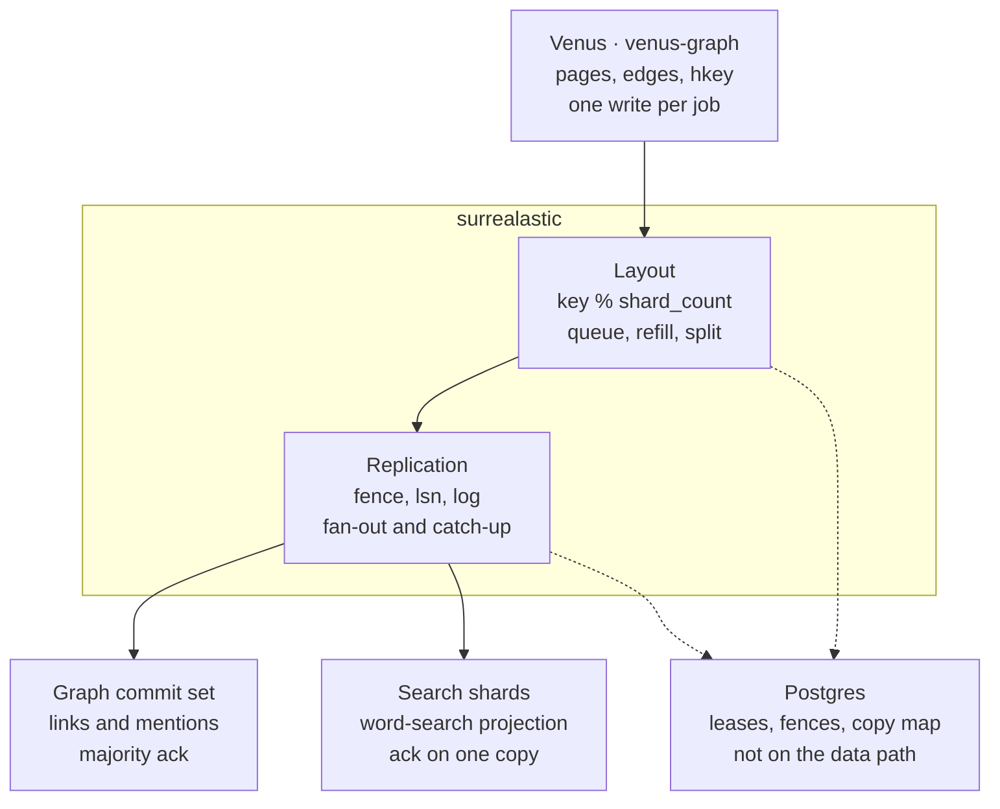

# Scale — graph store and search store

**Status:** design. Same engine as [store.md](./store.md): **SurrealDB**. Two roles: the **graph** (truth for links, mentions, and model binds) and **search** (a projection of heading and mention text). **Surrealastic** (`crates/surrealastic`) is the extension between them and Venus: replication, sharding, and clustering, in the style of a search cluster, on stock SurrealDB servers. Venus calls it once per job. Cluster summary, search schema, and memory: [search-scale](./search-scale/README.md). First board: [search-scale/plan.md](./search-scale/plan.md).

Traversal, mentions, and model edges stay in the graph namespace ([store](./store.md)). A `@@` query hits the search namespace only, then hydrates ids from the graph when the graph answers.

## Layers

**Surrealastic** is that extension: one crate, two parts. The layout places a write. Replication makes each database durable. SurrealDB stores the bytes. Postgres only remembers who may write and where the copies live.



Solid arrows are the write. Dotted arrows are the map: a lease claim, a copy changing state, `NOTIFY repl_map`. A single log entry does not touch Postgres.

| Layer | Why it is separate | What it does |
|---|---|---|
| **Venus** | The product knows a page, an edge, and `hkey`. Surrealastic stays free of those types, so another index can use the same path. | Builds the graph body and one search item per doc (`key = hkey`, `item = doc_id`, the doc’s record ids). Calls `surrealastic` once. Returns each set’s schema from `schema(set)`. Registers `rebuild` / `lost` only for the graph commit set. |
| **Layout** (surrealastic) | Shard count, a down shard, and a split are placement problems. The product should not learn which shard lagged. | Writes the commit set, then applies each item to `key % shard_count`. Keeps a shard queued until a copy acks, and rebuilds that queue from shard cursors after a takeover. Refills an empty shard, and fills a split, from the current items. |
| **Replication** (surrealastic) | SurrealDB does not replicate a RocksDB file, and the server has no hook on its write path. A fork would be rebased on every release. | One replica set: guarded log entry, fence, contiguous `lsn`, fan-out, catch-up, snapshot, takeover. Copies are equal. Postgres names the writer. |
| **Graph commit set** | Model edges are expensive and are not in git, so this database is the durable truth. Traversal needs the whole wiki in one database. | SurrealDB, namespace `graph`. Majority ack. Holds pages, edges, and `_layout_item`: the current item for each key, which the layout reads to fill a shard. |
| **Search shards** | Word search is heavier than edges and can be rebuilt. It gets its own memory cap and can lose a copy without stopping the graph. | SurrealDB, namespace `search`, one database per shard. Ack on one copy. Full-text indexes only. No edges. |
| **Postgres** | Something outside the data path must hand out the writer lease and record where copies live. The log stays next to the data so a map query is not on every write. | `repl_lease`, `repl_node`, `repl_set`, `repl_copy`, `layout_db`. Written when a lease is claimed or a copy changes state. |

## Why two stores of the same engine

A graph write and a search posting cannot share one transaction once they are different processes. Venus accepts that gap because the graph is replicated and search can be rebuilt from it. The gap is one way: search is behind the graph, or equal to it. Search never knows an edge the graph has dropped.

Exact lookups stay on the graph and do not wait for the projection: `norm` (UUID, email, endpoint), `RELATE`, unresolved `links_to`. Those are the pack. Word search is the leftover (a heading body, a rare word, later a person typing in a box). That leftover is what moves to the second store when readers or a large wiki make postings heavier than edges.

| Role | Holds | Does not hold |
|---|---|---|
| **Graph** | Pages, headings (including `body` for evidence), mentions, terms, symbols, all `RELATE` edges, model binds, `hkey` | A `SEARCH` / full-text index |
| **Search** | A copy of page title, heading `text` + `body` + gist, mention `text` + `norm`, and the full-text indexes | Edges, quotes, confidence, the semantic model |

| | Graph | Search shard |
|---|---|---|
| Namespace | `graph` | `search` |
| Database | `⟨workspace_id⟩` | `⟨{workspace_id}_{epoch}_{shard}⟩` |
| Replica set | one per wiki, pool `graph` | one per shard, pool `search` |
| Copies | 3 in HA, 1 in dev | `1 + replica_count` |

Every copy also holds the layer’s two tables, `_repl:state` and `_repl_log` ([The log](#the-log)). A graph copy also holds `_layout_item`, and a shard copy holds `_layout:cursor` ([The layout](#the-layout)). Indexes do not cross databases. BM25 is per shard copy.

## Durability

Most of the graph can be rebuilt from git: tree-sitter, Aho–Corasick, and regex are deterministic. **Model edges cannot.** They cost model calls, come out differently each time, and are not in git. So the graph is replicated with a **majority** acknowledgement and backed up. A graph write that was acknowledged survives the loss of any one copy.

Search is a projection. Every search row can be rebuilt from the graph commit set. A search copy exists for **availability** and **read throughput**. A search write needs **one** copy. A search shard that loses every copy is refilled by the layout from that commit set, never from a sibling shard.

Replication does not undo a bad write or a delete. Backups do ([Backups](#backups)).

## The replication layer

Replication inside `crates/surrealastic` replicates **any** SurrealDB database. It has no Venus types: no page, no doc, no shard rule. `venus-graph` links the crate in, so one process manages, writes, routes, and monitors.

```text
claim(set)                   → Writer        lease + fence from Postgres
writer.write(set, tx, tag)   → lsn           acked per the set's policy
read(set, query, min_lsn?)   → rows          any in-sync copy at or past min_lsn
hooks: schema(set)  → DDL                    statements every new copy gets before its first entry
       rebuild(set)                          owner refills a set with no copy left
       lost(set, tags)                       owner redoes work a resync discarded
```

| Owned by surrealastic replication | Owned by surrealastic layout | Owned by Venus |
|---|---|---|
| Leases and fence, `lsn`, the log, the guarded transaction, fan-out inside one set, ack, catch-up between copies, snapshot, takeover, divergence of one copy, retention, applying a set’s schema on a new copy, rendezvous placement, the monitor, the map cache, copy choice, hedging, failover | Which shard set a `key` lands on, the commit set, `_layout_item`, the shard cursor, apply after the commit, queued apply and its rebuild after takeover, refill of a shard from `_layout_item`, split and dual-apply | The statements in each body, the integer `key` (`hkey`), the item id (`doc_id`) and record ids, graph schema and search schema (through `schema`), BM25 merge, hydrate. `rebuild` / `lost` only for the commit set |

### Why a layer, not a SurrealDB patch

- The SurrealDB server is BSL-licensed. A fork is rebased on every release. The server has no hook in its write path.
- SurrealDB changefeeds are asynchronous and per table. Replicating from them needs a leader copy, which brings back failover and serial round trips.
- A layer above the server replicates **transactions**. Each process stays `surreal start rocksdb:…`. The layer can later run as its own proxy binary without changing this design.

### Replica sets and policy

A **replica set** is one database with equal copies on different nodes in different zones. Every copy takes writes. Every in-sync copy serves reads. There is no leader copy.

| Policy | Graph set | Search set |
|---|---|---|
| Copies | 3 (HA). Dev: 1. | `1 + replica_count` (2) |
| `ack` | **2** (majority) | **1** |
| Writes continue with | 2 of 3 copies up | 1 copy up |
| Acked write survives | loss of 1 copy | loss of every copy (refilled from the graph) |
| Takeover reads | a majority of copies | every reachable copy |
| `rebuild` hook | Re-extract from git, then import model edges from the latest backup | The layout refills that shard from `_layout_item` on the commit set. The owner is not called |
| `lost` hook | Re-run those graph jobs | The layout refills the shard from the commit set. The owner is not called |

## Roles

| Process | Does | Never |
|---|---|---|
| **Writer**: the `venus-graph` process holding lease `writer:{workspace_id}` | Calls the layout once per job, then catch-up, joins, snapshots, splits, and log retention | Writes without the lease. Learns which shard lagged. |
| **Router**: any `venus-graph` process | Reads graph and search sets, merges, hydrates. Keeps the map in memory. | Writes. Needs a lease. |
| **Monitor**: the `venus-graph` process holding lease `monitor` | Probes nodes, writes node state | Writes data or copy state. |
| SurrealDB copy | Stores data and its own log. Enforces fence, no gaps, no divergence. | Opens a connection to another copy. |
| Postgres | Map, leases, fences | Holds the log. Is read per write or per query. |

One wiki has one writer at a time. Many wikis have many writers in parallel. Write throughput grows with wikis. Inside one wiki, each replica set has its own queue, and sets run in parallel.

## The log

Every copy keeps its own log, in **its own database**, next to the data, in the same RocksDB file. The log entry, the data change, and the position are written in **one transaction**. A copy never has data without its log entry, or a log entry without its data. After a crash its log, its position, and its data agree.

```surql
DEFINE TABLE _repl SCHEMAFULL;              -- one row: _repl:state
DEFINE FIELD fence         ON _repl TYPE int;
DEFINE FIELD applied_lsn   ON _repl TYPE int;
DEFINE FIELD applied_fence ON _repl TYPE int;

DEFINE TABLE _repl_log SCHEMAFULL;          -- one row per applied write, id = lsn
DEFINE FIELD fence         ON _repl_log TYPE int;
DEFINE FIELD tag           ON _repl_log TYPE string;
DEFINE FIELD body          ON _repl_log TYPE object;   -- statements + parameters
DEFINE FIELD at            ON _repl_log TYPE datetime;
```

| Term | Rule |
|---|---|
| `lsn` | Per replica set. Contiguous: 1, 2, 3, … The writer issues `head + 1`. |
| `fence` | Per wiki writer lease. +1 each time a different process claims it. Stored on every entry. |
| `(lsn, fence)` | Identifies an entry. Two copies with the same pair at the same `lsn` have the same history up to it, as Raft’s index and term. |
| `tag` | Opaque to the layer. Venus puts the doc ids or the job id there. |

The `lsn` is the record id, and it is an **integer**: `_repl_log:42`. RocksDB keys are ordered by table and id, so a range of ids is a key-range read in `lsn` order, with no secondary index:

```surql
SELECT * FROM _repl_log:41..=50;        -- catch-up: entries after a copy's position
DELETE _repl_log:..=$upto;              -- retention
```

A string id (`_repl_log:⟨42⟩`) sorts as text and puts `"100"` before `"42"`. `WHERE lsn > $x` on a field scans the table. Both are refused.

Postgres does not hold the log. The writer keeps the head and each copy’s position in memory and can rebuild both from the copies.

## Guarded write

Each write names the entry it follows. Each copy checks that against its own `_repl:state` and nothing else:

```text
write(lsn, prev = lsn - 1, prev_fence, fence, tag, body)

BEGIN
  if state.fence > fence                                     THROW "fenced"
  if state.applied_lsn = lsn and state.applied_fence = fence RETURN "already"   retry of the last write
  if state.applied_lsn < prev                                THROW "gap at {applied_lsn}"
  if state.applied_lsn > prev                                THROW "divergent"
  if state.applied_fence != prev_fence                       THROW "divergent"
  <body>
  UPSERT _repl_log:{lsn} CONTENT { fence, tag, body, at: $at }
  UPDATE _repl:state SET fence = fence, applied_lsn = lsn, applied_fence = fence
COMMIT
```

`prev = 0` with `applied_lsn = 0` is the first entry of a set. The log row is an `UPSERT` so that a snapshot import followed by a replay does not fail on an id that is already there.

A copy that missed entry 41 refuses entry 42 and reports its own position. It asks nobody. When no write arrives, the copy does not learn it is behind and does not need to: every write reply and every probe returns its `applied_lsn`, and the writer compares that with the head.

**Body rule.** A body must give the same result on every copy, and the same result when applied twice. Ids are explicit. Time and random values are parameters, filled once by the writer. Writes replace rows (`UPSERT … CONTENT`, `DELETE` by id or id range), they do not increment. The layer refuses `rand::*`, `time::now()`, `CREATE` without an id, and `+=` / `-=`. Venus graph writes replace one doc’s rows and outbound edges. Search writes replace one doc’s rows. Both fit.

## Schema

A set’s schema is the `DEFINE` statements its owner returns from `schema(set)`, each with `IF NOT EXISTS` or `OVERWRITE` so it can run twice. Venus returns the graph schema for a graph set and the search schema for a shard set.

- **New copy.** `ensure(set)` creates the database, the `_repl` tables, and that schema before the copy takes its first entry or import. This covers a join with nothing to snapshot from, a refill onto a new set, a split’s new sets, and an epoch rebuild. A snapshot import carries the schema too; `ensure` still runs first.
- **Change.** A schema change on live sets is one guarded entry whose body is `define` operations, so every copy applies it at the same `lsn`. The owner’s `schema(set)` returns the new statements from the same release, so a copy built later gets them from `ensure`.
- The body builder’s `define(statement)` accepts only `DEFINE …` and `REMOVE …`. The body rule still applies.

Nothing else writes DDL to a copy.

## The layout

The layout is the other half of `crates/surrealastic`. It has no Venus types: no page, no doc, no hash of a field. The caller supplies an integer `key` already computed. Venus sets `key = hkey` ([Shards](#shards)).

A **database** in the layout is one **commit set** plus its shard sets. The commit set is one replica set and is not sharded. For a wiki, that set is the graph. Each shard set is its own replica set in the search pool. The layout stores `epoch`, `shard_count`, `shard_count_next`, `replica_count`, and `shard_ack` on `layout_db`.

```text
write(db, commit_body, items) → commit     commit is the commit set's lsn
read(db, query, min_commit?)  → rows, partial
lag(db)                       → per shard: commit head − cursor

Item { key: i64, item: string, tag: string, rids: [string], body, delete: bool }
shard = key % shard_count
```

| Field | Rule |
|---|---|
| `key` | Integer the caller computed. The record id of the item row and the shard rule. Venus: `hkey`. |
| `item` | The caller’s identity for that key. Venus: `doc_id`. Stored and compared, not parsed. |
| `tag` | Opaque. Stored, not read. Venus: the job id. |
| `rids` | The record ids or id ranges the body writes on a shard. Venus: that doc’s heading and mention id ranges. They remove an item from a shard without a field scan. |
| `body` | Shard statements, under the body rule. |
| `delete` | The item is gone. The layout deletes its stored `rids` on the shard and removes its row. |

### Item table

The commit set’s database holds the **current** item for each key:

```surql
DEFINE TABLE _layout_item SCHEMAFULL;          -- id = key, an integer: _layout_item:4711
DEFINE FIELD item   ON _layout_item TYPE string;
DEFINE FIELD tag    ON _layout_item TYPE string;
DEFINE FIELD rids   ON _layout_item TYPE array<string>;
DEFINE FIELD body   ON _layout_item TYPE object;  -- statements + parameters
DEFINE FIELD commit ON _layout_item TYPE int;     -- commit lsn that last wrote this row
```

The commit entry upserts or deletes these rows in the same transaction as the graph body. If `_layout_item:{key}` exists with a different `item`, the entry throws `key collision`, and the whole commit is not acked. With 63-bit keys this is not expected; it is refused rather than overwritten.

Ids are integers, so the table is read in key order by range (`_layout_item:$from..`), `REPL_CATCHUP_BATCH` rows at a time. A shard is filled from the current items, not from the history of the log.

### Shard cursor

Each shard database holds one row, `_layout:cursor`, with `commit`: the highest commit that shard has applied. Every shard entry sets it in the same transaction as its items, so a copy’s cursor and its rows agree. The cursor is data, so it replicates with the entry and survives a snapshot.

| Use | Rule |
|---|---|
| Queue | A shard’s pending commits are those after its cursor, up to the commit head. |
| Takeover | The new writer reads each shard’s cursor from that set’s takeover reference and reads those commits from the commit set’s `_repl_log` by range. They are applied in commit order. Nothing is lost when the old writer’s memory is gone. |
| Behind the log | A cursor below the oldest retained commit entry: that shard is refilled. |
| Fresh read | `read(db, query, min_commit)` starts each shard read with `if _layout:cursor.commit < $min_commit THROW "behind"`. A copy that is behind fails over. No copy at `min_commit`: the shard is in `partial` with reason `behind`. |
| Lag | `lag(db)` is the commit head minus each shard’s cursor. A pack may say that word search lags. |

### Refill

Used for a shard with no copy, a shard behind the oldest retained commit entry, a split’s new sets, and an epoch rebuild:

1. On an in-sync commit-set copy, read `L0 = applied_lsn`.
2. Each target copy starts from an empty database, also when the shard still had rows (an item deleted before `L0` has no row left to delete it by). `ensure` it, with the schema.
3. Read `_layout_item` by key range. Keep the items whose `key` lands on the target shard. Write them as shard entries within `REPL_ENTRY_DOCS` and `REPL_ENTRY_BYTES`. The last one sets the cursor to `L0`.
4. Apply the commits after `L0` from the queue.

Rows read after `L0` may already hold a later version. Applying the commits after `L0` over them is safe: bodies replace rows, so the shard ends at the same state as the commit set. One pass over the items fills every new set of a split.

## Write path

```mermaid
sequenceDiagram
  participant V as Venus (owner)
  participant L as surrealastic layout
  participant G as graph commit set
  participant S as search copies of shard s

  V->>L: write(commit_body, items)
  L->>G: entry n: commit_body and the _layout_item rows
  G-->>L: acked
  L-->>V: commit n
  par every touched shard set, ack 1
    L->>S: entry m: items whose key lands on s
  end
  Note over L,S: a shard that cannot ack stays queued; V is not called again
```

1. **Commit.** One entry on the commit set: the graph body (pages, headings, mentions, outbound edges) and the `_layout_item` upserts and deletes for the items. Acked on 2 of 3. Not acked (or `key collision`): the call fails, and nothing is sent to a shard.
2. **Return.** The caller receives `commit`. It does not learn which shard lagged.
3. **Apply.** The layout groups items by `shard = key % shard_count`. While `shard_count_next` is set, each item also goes to `key % shard_count_next`. One entry per touched shard, at most `REPL_ENTRY_DOCS` (256) items or `REPL_ENTRY_BYTES` (4 MiB). Each entry also sets that shard’s `_layout:cursor`. Every touched shard set at once. Acked on 1.
4. **Queue.** A shard with no acking copy keeps that commit queued, behind any earlier queued commits; they apply in commit order. When a copy is up, the layout applies them. The commit set is not written again. The queue is the writer’s memory, and a new writer rebuilds it from the [shard cursors](#shard-cursor).

Fan-out inside one set is parallel across its copies. **One write in flight per copy**, in `lsn` order: entry `n + 1` goes to a copy after that copy answered `n`. A copy more than `REPL_LAG_MAX` (64) entries or 1 s behind the head leaves the live stream, becomes `lagging`, and is filled by [catch-up](#catch-up).

The ack waits for the `ack`-th fastest copy, not the slowest. Postgres is written only when a copy changes state. The shard cursor is how a read knows the projection has caught up. Venus does not write `page.search_error`, and it does not stamp `page.search_sha` from a shard ack.

### Protocol

| Path | Transport |
|---|---|
| Writes, catch-up, reads | SurrealDB **WebSocket** RPC, crate `surrealdb` `protocol-ws`. One connection per node per process, signed in once, requests multiplexed. Bodies are bound parameters. |
| Snapshot | HTTP `GET /export` from the source copy, `POST /import` into the empty copy |
| Probe | HTTP `GET /health`, plus a one-row read of `_repl:state` |
| Map and leases | Postgres, plus `LISTEN repl_map` |

No gRPC. No second port on a SurrealDB node. TLS (`rustls`) when a node is on another host. No compression: an entry is at most 4 MiB, and on one host compression costs more CPU than it saves.

## Catch-up

The writer is the only process that moves entries between copies. It reads a range from an in-sync copy and writes it to the lagging one. Copies never connect to each other.

```mermaid
sequenceDiagram
  participant W as venus-graph (writer lease)
  participant A as copy A (in sync, at 50)
  participant B as copy B (at 40)

  W->>B: entry 51, prev 50
  B-->>W: gap at 40
  Note over W: B lagging; live writes skip it
  W->>A: SELECT * FROM _repl_log:41..=50
  A-->>W: entries 41..50
  loop in lsn order
    W->>B: entry 41 (prev 40) … entry 50 (prev 49)
  end
  W->>B: entry 51, prev 50
  B-->>W: OK at 51
  Note over W: B in_sync
```

Live writes and catch-up for one set run on that set’s queue in the writer, so a backfill and a new write never race. Each backfilled entry is the same guarded transaction. A repeat is `already`. An out-of-order entry is a `gap`.

Catch-up reads at most `REPL_CATCHUP_BATCH` (500) entries per range read.

## Snapshot

Used when a copy is new, empty, or behind the oldest retained log entry, and when a copy is divergent.

1. On the source copy (in sync), read `L0 = applied_lsn` and its `applied_fence`.
2. `GET /export` of that database from the source.
3. Recreate the target database empty. `POST /import` the export.
4. On the target, set `_repl:state` to `applied_lsn = L0`, `applied_fence` from step 1, current `fence`.
5. Catch up from `L0`.

The export may be taken while writes continue, so it can hold effects past `L0`. Replaying entries after `L0` over it is safe because every body gives the same result when applied twice. This is a base backup plus log replay, as in PostgreSQL.

At most `REPL_MAX_BUILDS_PER_NODE` (2) snapshots run into one node at once.

## Writer takeover

The writer process holds no data. Every log is on its copies. When the lease moves:

1. The new process claims lease `writer:{workspace_id}`. Postgres returns a higher `fence`.
2. For each set it reads `_repl:state` from copies: `copies − ack + 1` of them when `ack > 1` (a **majority** for a graph set), else **every reachable** copy (a search set). Fewer than that reachable: that set’s writes wait.
3. The copy with the highest `(applied_lsn, applied_fence)` is the **reference**. By quorum overlap, for a graph set it holds every acked entry.
4. The others are caught up from the reference.
5. New entries continue from the reference’s head, with the new fence. The old process, if it is still alive, is `fenced` on every copy.

A `lagging` copy is never chosen as the reference while a quorum of others answers.

## Divergence

A copy can hold an entry that no one else has: the old writer sent it, that one copy committed, and the write was never acked. After takeover the new history continues without it. The copy’s next write fails the guard (`applied_lsn > prev`, or the fence at `prev` differs), and the reply is `divergent`.

A divergent copy is rebuilt by [snapshot](#snapshot) from an in-sync copy of the same set. On the commit set, before the rebuild, the writer reads the copy’s entries past the common point and passes their `tag`s to `lost(set, tags)`. The graph owner re-runs those jobs. On a shard set, the layout does not call the owner: the copy is snapshot from an in-sync copy, or refilled from `_layout_item` when no other copy of that shard remains. Nothing that was acked is lost: a graph entry acked on 2 of 3 is in the reference. A search item that was acked on the commit set is in `_layout_item`.

## Log retention

The writer deletes log entries that every copy of the set has applied, and entries past `REPL_LOG_RETAIN` (older than 24 h, or beyond the newest 1M entries), whichever limit is hit first. A copy that is down longer than that returns through a snapshot, not a replay.

Graph sets archive each range to object storage before deleting it. Search sets do not archive.

Commit-set retention does not wait for shard cursors. A shard whose cursor is below the oldest retained commit entry is refilled from `_layout_item` ([Refill](#refill)). The log is never replayed from 1 to fill a shard.

## Backups

| What | How | Restores |
|---|---|---|
| Graph set, nightly | `GET /export` from one in-sync copy, with its `L0`, to object storage | A whole wiki graph, including model edges |
| Graph log archive | Ranges removed by retention | With the nightly export: point-in-time restore |
| Search | None | Rebuilt from the graph |

Restore is a snapshot import from the backup, then a replay from the archive up to the chosen `lsn`.

## Read path

1. **Map.** The router keeps `repl_set`, `repl_node`, `repl_copy`, and `layout_db` in memory. A change sends `NOTIFY repl_map`. The router also reloads every 30 s. Postgres being down does not stop reads.
2. **Pick.** Candidates are `in_sync` copies on nodes that are `up` (else `suspect`). Pick two at random and use the one with fewer requests in flight. A tie goes to the lower recent latency.
3. **Hedge.** If that copy has not answered after its p95 latency (floor `REPL_HEDGE_FLOOR_MS`, 20 ms), send the same read to another candidate. The first answer wins. One hedge per set per request.
4. **Fail over.** A connection error or a timeout tries the next candidate in the same request. The router ejects that node locally for 5 s. It does not write Postgres.
5. **Fresh read.** A caller may send `min_lsn`. The read starts with `if _repl:state.applied_lsn < $min_lsn THROW "behind"`, and a copy that is behind fails over to the next.

For `@@`:

6. Each search set returns its top `k + offset` by `search::score`. The router merges, removes duplicate record ids, and cuts. A shard with no answer within `SEARCH_SHARD_TIMEOUT_MS` (2 s) is listed in `partial` with reason `timeout`; a shard with no copy at `min_commit` is listed with reason `behind`.
7. **Hydrate.** One batched read of the graph set, budget `SEARCH_HYDRATE_MS` (100 ms). A hit whose graph row is gone is dropped. When no graph copy answers, hits are built from search rows (title, `git_path`, heading text, `block_id`) and marked `unverified`.

Packs read any in-sync graph copy, with `min_lsn` set to the job that produced them when they must see it. Word search in a pack passes that job’s commit as `min_commit`, and the pack says word search lags when `lag(db)` is above 0.

Scores are per shard. A new wiki has one shard, so its scores are comparable. BM25 scores a term 0 when it appears in half or more rows of that copy.

## Placement

Nodes belong to a **pool**: `graph` or `search`. Pools are separate processes, which is why the graph and search were split. Each set has `copies` homes in its pool, chosen by **rendezvous** (highest random weight) hashing. The rule is defined for every N:

```text
members  = repl_node rows in this pool with state not draining or removed     (down nodes stay members)
u(node)  = (xxh3_64(set_id ‖ ":" ‖ node_id) + 1) / 2^64
score    = -weight(node) / ln(u(node))                              weight defaults to 1
ranked   = members by score descending, node_id ascending on a tie
homes    = walk ranked; skip a node whose zone is already a home of this set;
           stop at copies homes
```

`set_id` is `graph:{workspace_id}` or `search:{workspace_id}:{epoch}:{shard}`.

- Copies of one set are in distinct zones, so on distinct nodes. Production zone is the host. Dev zone is the container (`zone = node_id`).
- Fewer zones than `copies` places fewer copies. That set is **yellow**. Two copies are never stacked.
- Each set ranks the nodes differently, so all wikis spread over all nodes of a pool.
- A node joining takes a copy of a set only where it enters that set’s top `copies`: about `copies / N` of all copies. No other copy moves.
- A node leaving moves only its own copies, each to the next node in that set’s ranking.
- `weight` sizes a node. A node with weight 2 gets about twice the copies.
- `copies` must be ≤ the zones in the pool.

| Pool | N | Copies | Where |
|---|---|---|---|
| search | 2 | 2 | Both nodes hold both shards. **This board.** |
| search | 3 | 2 | Two of three nodes per shard. **HA default.** |
| search | 3 | 3 | All three nodes. `replica_count = 2`, not the default. |
| graph | 1 | 1 | Dev. |
| graph | 3 | 3 | Every wiki graph on all three. HA. |
| graph | 9 | 3 | Three of nine per wiki, spread across all wikis. |

A wiki graph is one set and is not sharded: traversal needs the whole wiki in one database. Many wikis spread over many graph nodes.

Tests read homes from `repl_copy`. They do not hardcode which nodes a set lands on.

### Replacement and join

A `down` node keeps its homes for `REPL_REALLOCATE_DELAY_MS` (60 s). Writes continue on the other copies. A restart inside the delay is a catch-up, not a copy.

After the delay, the writer walks the ranking past the homes and places a `joining` copy on the next node that is not `down`, not draining, and in a zone the set does not already use. It is filled by snapshot from an in-sync copy, then catch-up. When the original home is back and `in_sync`, the replacement is removed. When an operator removes the dead node (state `removed`), the replacement is already the next home and stays; nothing else moves.

A removed node keeps its row with state `removed`, so its `node_id` is never handed out again.

Join a node:

1. Start the process with its own volume, cap, pool, and zone. `GET /health` is 200.
2. Insert `repl_node` with the next `node_id` from the sequence `repl_node_seq` (never reused; an id that has a row is refused), pool, url, zone, weight. `NOTIFY repl_map`.
3. Each writer recomputes its homes. Where the new node is now a home, it inserts a `joining` copy, fills it by snapshot and catch-up, and marks it `in_sync`.
4. Then it removes the copy that dropped out of that set’s homes and drops its database.

Reads ignore `joining` and `lagging`. A copy is removed only after its successor is `in_sync`.

## Shards

```text
hkey  = (uint64 big-endian of sha256(doc_id as UTF-8)[0..8]) >> 1
key   = hkey
shard = key % shard_count
```

`hkey` is 63 bits so it fits SurrealDB `int` and stays non-negative under `%`. Venus stores it on the graph page and passes it as the item `key`. The layout does not hash a field. For a Venus item, `shard = hkey % shard_count`. Never the node count, never the git path. The same `doc_id` stays on the same shard while `shard_count` is the same.

| Setting | Value |
|---|---|
| New wiki | `shard_count = 1`. One query hop, one set of term statistics. |
| This board | `shard_count = 2`, so merge and placement are exercised. |
| Split trigger | A shard copy over 2 GB, or over 500k headings, or its `@@` p95 over `SEARCH_P95_TARGET_MS`. Checked by the writer’s 30 s sweep. |
| Cap | 64 shards per wiki |

**Split** doubles: `c → 2c`. Old shard `s` keeps its set and keeps the items where `key % 2c = s`. Only new sets `s + c` are built. Half the rows move.

1. Set `shard_count_next = 2c`. Create the new sets on their rendezvous homes. Fill them in one [refill](#refill) pass over `_layout_item`: set `s + c` takes the items whose `key % 2c = s + c`.
2. Live writes apply to both groupings. Reads stay on `c`.
3. When every new set has an in-sync copy whose cursor is at the commit head, flip in one Postgres transaction: `shard_count = 2c`, `shard_count_next = null`.
4. One entry per old set deletes the items where `key % 2c ≠ s`, by the `rids` stored in `_layout_item`. Until then the router removes duplicate ids at merge.

**Rebuild** is any other change, including a shrink. It increments `epoch`, which makes new sets, fills them by a refill pass over `_layout_item`, applies live writes to both epochs, flips, then drops the old epoch. The owner is not called.

A sibling shard is not a split source and not a copy.

## Failure detection

The monitor holds lease `monitor` (10 s, renewed every 3 s). Any `venus-graph` process can take it over.

| Signal | Rule |
|---|---|
| Probe | Every `REPL_PROBE_MS` (1 s): `GET /health` and a one-row read of `_repl:state` in one database on that node. |
| `up` → `suspect` | 3 missed probes. Routers prefer other copies. Nothing moves. |
| `suspect` → `down` | `REPL_DOWN_MS` (10 s) without a good probe. Writers stop sending to that node’s copies and mark them `lagging`. The replacement delay starts. |
| → `up` | First good probe. Its lagging copies start catch-up. |
| `draining` | Set by an operator. Copies move off, then the node is `removed`. |
| `removed` | Final. Not a member. The row stays so the `node_id` is never reused. |
| Router errors | Eject the node locally for 5 s. No Postgres write. |
| Writer errors | `gap` or timeout: that copy `lagging`. `divergent`: that copy is resynced. `fenced`: this process lost the lease and stops. |

Node state is written by one monitor. Copy state is written by that wiki’s writer. Positions (`applied_lsn`) come from write replies, catch-up, and a sweep every 30 s of copies that were not written recently.

| Health | Meaning |
|---|---|
| **Green** | Every set has `copies` in-sync copies on `up` nodes. |
| **Yellow** | Every set can still ack (graph: 2 in sync; search: 1). Some have fewer than `copies`. |
| **Red** | A set cannot ack. Graph: writes wait, reads continue from any in-sync copy. Search: that shard is absent from word search; the graph still answers links and `norm`. |

## Restore, case by case

| Failure | Restore |
|---|---|
| Copy missed some entries | Catch-up from an in-sync copy’s `_repl_log`. |
| Node restarted inside the delay | Its copies report `applied_lsn` from their own disk. Catch-up. Usually seconds. |
| Node down past the delay | Replacement copy on the next ranked node: snapshot, then catch-up. |
| Volume wiped | `applied_lsn = 0`. Log from 1 retained: replay. Otherwise snapshot, then catch-up. |
| Copy divergent | `lost(tags)`, then snapshot from an in-sync copy. |
| Writer stalls past its lease | Its writes are `fenced` on every copy. |
| Writer dies mid-write | Next writer: reference = highest copy of a majority (graph) or of all reachable (search). Others caught up from it. |
| Writer dies with shard commits queued | Next writer reads each shard’s `_layout:cursor` and applies the commits after it, in order, from the commit set’s log. |
| Shard cursor behind the retained commit log | Refill from `_layout_item`. |
| One graph copy | Writes continue on 2 of 3. Reads from the others. |
| Two graph copies | Reads continue from the third. Writes wait until a second copy is in sync. |
| Every copy of a search set | The layout refills it from `_layout_item` on the commit set. Never from a sibling shard. |
| Every copy of a graph set | `rebuild`: re-extract from git, import model edges from the backup, replay the archive. |
| Postgres | Reads continue from the cached map. Writes stop (leases cannot renew). Flush stops too. |
| Every `venus-graph` process | No writes and no routed reads. Copies keep their data and logs. |

## Postgres tables

Surrealastic owns the `repl_*` tables and `layout_db`. Step 3’s `search_cluster` is migrated into `layout_db`. The migration runs from `crates/venus-graph`, not from the hub `schema.sql` and not from flush `jobs`.

```text
repl_lease
  name           primary key    writer:{workspace_id} | monitor
  holder         text
  fence          bigint         +1 when a different holder claims
  lease_until    timestamptz

repl_node
  node_id        primary key    "0", "1", … from repl_node_seq, never reused
  pool           graph | search
  url
  zone           text
  weight         int            default 1
  state          up | suspect | down | draining | removed
  state_at       timestamptz

repl_set
  set_id         primary key    graph:{ws} | search:{ws}:{epoch}:{shard}
  pool           graph | search
  namespace      text
  database       text
  copies         int
  ack            int
  lease          text           repl_lease.name allowed to write

repl_copy
  set_id
  node_id
  state          joining | in_sync | lagging
  applied_lsn    bigint         last position the writer saw (a cache; _repl:state on the copy is the truth)
  primary key (set_id, node_id)

layout_db                      surrealastic
  db_id              primary key    search:{ws}
  commit_set         text           graph:{ws}
  epoch              int            +1 on a shrink or other non-doubling rebuild
  shard_count        int
  shard_count_next   int null       set while a split or rebuild is open
  replica_count      int            shard copies = 1 + replica_count
  shard_ack          int            1 for search
```

There is no role column. Every copy takes writes and reads.

Lease claim or renew, one statement:

```sql
UPDATE repl_lease
   SET fence       = fence + CASE WHEN holder = $me THEN 0 ELSE 1 END,
       holder      = $me,
       lease_until = now() + interval '10 seconds'
 WHERE name = $name AND (holder = $me OR lease_until < now())
RETURNING fence;
```

No row returned: another process holds the lease. A writer that cannot renew stops sending. Safety does not depend on that: every copy checks the fence.

## Defaults

| Name | Default |
|---|---|
| Lease | 10 s, renewed every 3 s |
| `REPL_ENTRY_DOCS` / `REPL_ENTRY_BYTES` | 256 / 4 MiB |
| `REPL_LAG_MAX` | 64 entries or 1 s |
| `REPL_CATCHUP_BATCH` | 500 entries |
| `REPL_LOG_RETAIN` | 24 h or 1M entries |
| `REPL_PROBE_MS` | 1 000 |
| `REPL_DOWN_MS` | 10 000 |
| `REPL_REALLOCATE_DELAY_MS` | 60 000 (tests set it low) |
| `REPL_MAX_BUILDS_PER_NODE` | 2 |
| `REPL_HEDGE_FLOOR_MS` | 20 |
| `SEARCH_SHARD_TIMEOUT_MS` | 2 000 |
| `SEARCH_HYDRATE_MS` | 100 |
| `SEARCH_P95_TARGET_MS` | 200 (split trigger) |
| `GRAPH_COPIES` | 1 in dev, 3 in HA; `ack` is a majority |
| `REPL_ARCHIVE_URL` | `file://` in dev, `s3://` in production; graph sets only |
| `REPL_BACKUP_AT` | 03:00 UTC, nightly graph export |

## Why this shape

| Practice | From | Here |
|---|---|---|
| Ordered log, append checks the previous entry | Raft log replication (index and term) | `lsn`, `prev`, `prev_fence` checked by each copy |
| Leader chosen outside the data path | Configuration master (Vertical Paxos, Kafka controller) | Postgres lease and fence. Copies never vote. |
| Fencing token checked by the store | Leases with a monotonic token | `fence` in every guarded write |
| Majority ack, majority read at takeover | Quorum replication | Graph sets: ack 2 of 3; takeover reads 2 |
| Base backup plus log replay | PostgreSQL | Snapshot at `L0`, replay after it |
| Rendezvous placement | HRW hashing | Exact homes for any N, minimal movement |
| Delayed reallocation | Elasticsearch `node_left.delayed_timeout` | 60 s before a replacement copy |
| Hedged requests | Tail-latency practice | One hedge per set after p95 |

Not taken: Raft between SurrealDB processes (the layer is the only writer; Postgres chooses it), gossip (membership is a few rows with `NOTIFY`), read repair and hinted handoff (one fenced writer per set, catch-up from the log), a fork of the SurrealDB server.

## Compared with Elasticsearch

Surrealastic takes Elasticsearch’s cluster and leaves Lucene. The process is Rust. The index on this board is SurrealDB `SEARCH` (BM25 on RocksDB), not Lucene. Rust removes the JVM. It does not, by itself, make a query faster than Lucene.

| | Elasticsearch | Surrealastic |
|---|---|---|
| Unit of scale | A shard of documents | A shard of integer keys. Venus passes `hkey`. |
| Copies | One extra copy by default. Two copies of the shard. | `replica_count = 1`. Two copies, distinct zones. |
| Who takes a write | One copy accepts the index operation. The others apply it after. | Every in-sync copy applies the same log entry. Search returns when one copy has committed. Copies stay equal. |
| Where a copy sits | Allocation, with a delay before a shard moves off a dead node. | Rendezvous. `REPL_REALLOCATE_DELAY_MS` (60 s) before a replacement copy. |
| Query | A coordinator asks every shard and merges hits. | The router asks every shard, hedges one slow copy, merges hits. |
| Score | BM25 inside one shard. Scores from two shards are not one scale. | The same. A new wiki has one shard, so the scale is the wiki. |
| When a hit is visible | After the next refresh, about 1 s by default. | In the transaction that committed the log entry. |
| Growing the index | Split, or build the index again, when the shard count must change. | Split by doubling. The layout replays current items onto the new shard sets. |
| Membership | Master-eligible nodes publish cluster state. | Postgres holds the lease and the copy map. A search does not read Postgres. |
| If every copy of a shard is gone | Restore a snapshot, or build the index again. | Replay `_layout_item` from the graph commit set. |

**Faster here.** No JVM warmup and no garbage-collection pause on the router. A committed entry is searchable immediately. Search ack waits for the fastest copy, and the copies are written in parallel. A wiki that still has one shard pays no scatter across shards. Each search node has an explicit cap (1 GB, 64 MB block cache) instead of a JVM heap plus the page cache.

**Still decided by the index.** Elasticsearch batches documents into immutable Lucene segments, then walks postings at query time. Surrealastic applies a guarded transaction of at most 256 docs on every in-sync copy. That costs more per document and buys a fresher, recoverable index. On a large corpus a Lucene query is still the faster query. SurrealDB BM25 is the index because the same engine holds the graph and a shard is an ordinary SurrealDB database that the layout can refill.

**Tantivy later.** The layout does not read the body. It stores an item key, a tag, and statements, and it replicates those. A later shard can apply the same item to a Tantivy index instead of SurrealDB `SEARCH`. The commit set, the copies, the router, and the split stay. That is the upgrade that can pass Elasticsearch on the query. This board does not add that index. [search-scale](./search-scale/plan.md) keeps SurrealDB `SEARCH`.

## Do not

- Let a SurrealDB copy open a connection to another copy.
- Write a replicated database outside surrealastic.
- Send a write without `lsn`, `prev`, and `fence`, or accept one that fails the guard.
- Send live entries to a `lagging` copy, or more than one entry in flight to a copy.
- Use a string id or a field scan for `_repl_log` or `_layout_item`.
- Write DDL to a copy outside `ensure` or a guarded entry.
- Fill a shard by replaying the commit log from the start, or refill into a database that still has rows.
- Overwrite an item row whose `item` differs from the write.
- Keep the shard cursor anywhere but in that shard’s own database.
- Reuse a `node_id`.
- Use `rand::*`, `time::now()`, id-less `CREATE`, or increments in a replicated body.
- Choose a lagging copy as the takeover reference while a quorum answers.
- Read from a `joining` or `lagging` copy.
- Place two copies of one set in one zone.
- Use `hash % N` for documents or copies.
- Move copies when a node is `down` for less than the delay.
- Rebuild a search shard from a sibling shard, or a graph from markdown while a graph copy or backup exists.
- Return a per-shard failure from `layout.write`. The caller hears only that the commit set did not ack.
- Put Postgres on the per-write or per-read path.
- Flip `shard_count` before every new set has an in-sync copy at its head.
- Block `last_flushed` on a graph or search write.

Invariant: every search row’s `indexed_sha` equals the graph `indexed_sha` it was copied from; Venus puts the page’s `indexed_sha` in each item body. The projection clock is that shard’s `_layout:cursor.commit`. `page.search_sha` and `page.search_error` stay on the graph schema; the owner does not stamp them from a shard ack and does not retry from `search_error`. A copy’s `applied_lsn` ≤ its set’s head. Two copies with the same `(applied_lsn, applied_fence)` have the same data. A pack may say that word search lags, the same way AB2 says the index lags the live page.

Gist updates project again after the semantic pass (heading gist field only), as a new search entry. Model edges stay on the graph. The semantic call does not read the search store.
