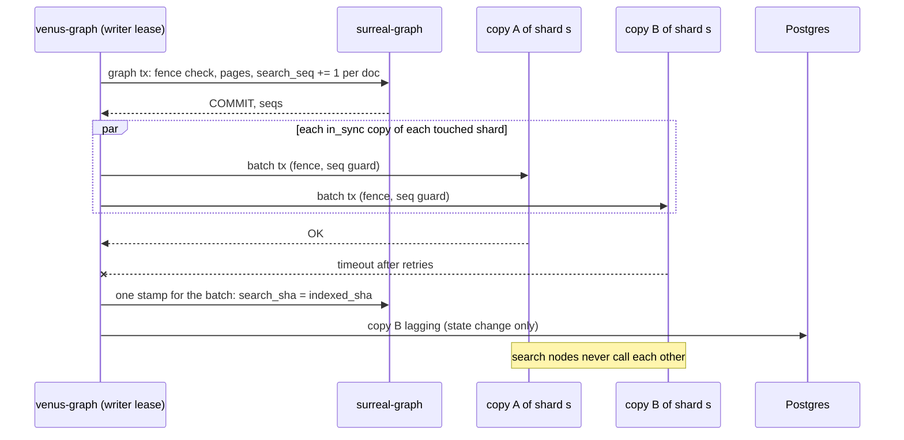

# Scale — graph store and search store

**Status:** design. Same engine as [store.md](./store.md): **SurrealDB**. Two roles. Word search is a **projection** of the graph, written after the graph commit. `surreal-search` is a set of SurrealDB processes that hold **search rows only**. Every copy of a shard is equal. Writes carry a fence and a sequence number, and a copy keeps only the newest. Cluster summary, schema, and memory: [search-scale](./search-scale/README.md). First board: [search-scale/plan.md](./search-scale/plan.md).

Traversal, mentions, and model edges stay in the graph namespace ([store](./store.md)). A `@@` query hits the search namespace only, then hydrates ids from the graph when the graph answers.

## Why two stores of the same engine

A graph write and a search posting cannot share one transaction once they are different processes. Venus accepts that gap because git is the spec and the graph can be rebuilt. The gap is one way: search is behind the graph, or equal to it. Search never knows an edge the graph has dropped.

Exact lookups stay on the graph and do not wait for the projection: `norm` (UUID, email, endpoint), `RELATE`, unresolved `links_to`. Those are the pack. Word search is the leftover (a heading body, a rare word, later a person typing in a box). That leftover is what moves to the second store when readers or a large wiki make postings heavier than edges.

| Role | Holds | Does not hold |
|---|---|---|
| **Graph** | Pages, headings (including `body` for evidence), mentions, terms, symbols, all `RELATE` edges, model binds, `search_seq`, `hkey` | A `SEARCH` / full-text index |
| **Search** | A copy of page title, heading `text` + `body` + gist, mention `text` + `norm`, the full-text indexes, `meta:shard` | Edges, quotes, confidence, the semantic model |

| | Graph | Search shard copy |
|---|---|---|
| Namespace | `graph` | `search` |
| Database | `⟨workspace_id⟩` | `⟨{workspace_id}_{epoch}_{shard}⟩` |
| Process | One per wiki (`GRAPH_URL`) | One process per **node**. A node holds copies of many shards of many wikis, one database each, in one RocksDB file. |

Indexes do not cross databases. BM25 is per shard copy.

## Durability

Search durability is the graph’s durability. Every search row can be rebuilt from graph rows. A copy exists for **availability** and **read throughput**, not to keep data alive.

That is why a write needs one committed copy, not a quorum. That is why copies do not elect a leader. That is why a lost copy is refilled from the graph, never from a sibling shard and never from another search node’s files.

## Roles

| Process | Does | Never |
|---|---|---|
| `surreal-graph` | Holds the truth. Assigns `search_seq` inside the graph transaction. | Calls a search node. |
| **Writer**: the `venus-graph` process holding lease `writer:{workspace_id}` | Graph transaction, search batches, stamp, catch-up, joins, splits for that wiki | Writes without the lease. |
| **Router**: any `venus-graph` process | `@@` fan-out, merge, hydrate. Keeps the map in memory. | Writes search rows. Needs a lease. |
| **Monitor**: the `venus-graph` process holding lease `monitor` | Probes nodes. Writes `search_node.state`. | Writes search rows or copy state. |
| Search node | Stores copies. Checks fence and seq inside each transaction. | Opens a connection to another search node. |
| Postgres | Map, leases | Is read per document or per query. |

One wiki has one writer at a time. Many wikis have many writers in parallel. Write throughput grows with wikis, not inside one wiki. Inside one wiki the writer runs one queue per shard, and shards run in parallel.

## Fence and sequence

Two numbers make every write safe to retry, reorder, or replay.

| Number | Where | Rule |
|---|---|---|
| `fence` | `graph_lease.fence` in Postgres | +1 each time a **different** holder claims the lease. A renew by the same holder does not change it. |
| `seq` | `graph_meta:workspace.search_seq` on the graph | +1 per projected document, inside the graph transaction. Copied to `page.search_seq`. |

Lease: `GRAPH_LEASE_MS` 10 s, renewed every 3 s.

```sql
-- claim or renew
UPDATE graph_lease
   SET fence       = fence + CASE WHEN holder = $me THEN 0 ELSE 1 END,
       holder      = $me,
       lease_until = now() + interval '10 seconds'
 WHERE name = $name AND (holder = $me OR lease_until < now())
RETURNING fence;
```

No row returned means another process holds the lease. A writer that cannot renew stops sending writes. That is a courtesy. Safety is the fence check inside every graph and search transaction:

```text
graph transaction                     search batch transaction (per shard copy)
  if graph_meta.fence > $fence THROW    if meta:shard.fence > $fence THROW "fenced"
  set graph_meta.fence = $fence         set meta:shard.fence = $fence
  for each doc: search_seq += 1         for each doc in $docs:
  page.search_seq = search_seq            if page:⟨id⟩.seq >= doc.seq → skip
  page.hkey = hkey(doc_id)                delete that doc's rows by id range [docId, …]
                                          upsert page (seq), headings, mentions
                                        meta:shard.applied_seq = max(applied_seq, $max_seq)
```

A process that paused past its lease and wakes up gets `fenced` from every store. An older version never overwrites a newer one. A duplicate is a no-op. Exact SurrealQL is pinned and tested in [step 4](./search-scale/plan.md#4-step-project).

Delete is a tombstone. The graph sets `page.deleted = true` with a new `search_seq`. The batch deletes that doc’s rows and keeps `page:⟨docId⟩ { seq, deleted }` so an older replay cannot bring it back. The writer removes both tombstones once every copy of that shard has `applied_seq ≥ seq`.

## Write path



1. **Graph.** One transaction for the job’s documents. It assigns `seq` and `hkey`. A failure stops the job; nothing was sent to search.
2. **Group.** Documents are grouped by `shard = hkey % shard_count`. While `shard_count_next` is set, each doc also goes to `hkey % shard_count_next` ([Shards](#shards)).
3. **Batch.** One transaction per shard, at most `SEARCH_BATCH_DOCS` (256) docs or `SEARCH_BATCH_BYTES` (4 MiB). Documents are bound parameters, not SurrealQL text.
4. **Fan out.** The batch goes to every `in_sync` copy of that shard at once, and every touched shard at once. Each copy has at most one batch in flight, in `seq` order.
5. **Ack.** A shard is written when **one** copy commits ([Durability](#durability)).
6. **Stamp.** One graph update sets `search_sha = indexed_sha` and clears `search_error` for every doc whose shard was written. It carries the fence.
7. **Copy state.** A copy that failed after `SEARCH_WRITE_RETRIES` (2, at 100 ms and 400 ms) becomes `lagging`. Postgres is written only on that change. A lagging copy gets no live batches until [catch-up](#catch-up-join-restore) brings it back.
8. **No copy.** A shard where no copy committed sets `page.search_error` for its docs and leaves `search_sha`. The job retries those docs at 1 s, 4 s, 16 s, then every 60 s. The graph is not rolled back. The model is not re-run.

Cost per batch: graph transaction, one parallel round to the copies, stamp. Three round trips, whatever the batch size and `replica_count`. Postgres is not on the path.

Live batches and catch-up for one shard run on that shard’s queue in the writer. They do not interleave.

### Protocol

| Path | Transport |
|---|---|
| Graph and search transactions, `@@`, catch-up | SurrealDB **WebSocket** RPC, crate `surrealdb` `protocol-ws`. One connection per node per process, signed in once, requests multiplexed. |
| Probe | HTTP `GET /health`, plus a one-row read over the same WebSocket |
| Map and leases | Postgres, plus `LISTEN search_map` |

No gRPC. No second port on a search node. TLS (`rustls`) when a node is on another host. No compression: a batch is at most 4 MiB, and on one host compression costs more CPU than it saves. Revisit only with a measured cross-host bandwidth limit. Search nodes do not ship RocksDB files or WALs.

## Read path

1. **Map.** The router keeps `search_cluster`, `search_node`, and `search_allocation` in memory. Any transaction that changes them sends `NOTIFY search_map`. The router also reloads every 30 s. Postgres being down does not stop reads.
2. **Pick.** For each shard `0 .. shard_count - 1`, candidates are `in_sync` copies on nodes that are `up` (else `suspect`). Pick two at random and use the one with fewer requests in flight. A tie goes to the lower recent latency.
3. **Hedge.** If that copy has not answered after its p95 latency (floor `SEARCH_HEDGE_FLOOR_MS`, 20 ms), send the same query to another candidate. The first answer wins. The other is cancelled. One hedge per shard.
4. **Fail over.** A connection error or a timeout tries the next candidate in the same request. The router ejects that node locally for 5 s. It does not write Postgres.
5. **Merge.** Each shard returns its top `k + offset` by `search::score`. The router merges, removes duplicate record ids, and cuts.
6. **Partial.** A shard with no answer within `SEARCH_SHARD_TIMEOUT_MS` (2 s) is listed in `partial`. The rest of the result returns.
7. **Hydrate.** One batched graph read, budget `SEARCH_HYDRATE_MS` (100 ms). A hit whose graph row is gone is dropped. When the graph does not answer, the router returns hits built from search rows (title, `git_path`, heading text, `block_id`) marked `unverified`.
8. **Fresh read.** A caller may send `min_seq`. The query starts with `if meta:shard.applied_seq < $min_seq THROW "behind"`. A copy that is behind fails over to the next.

Without `min_seq`, reads are eventually consistent. Staleness is bounded by the copy’s `applied_seq`.

Scores are per shard. A new wiki has one shard, so its scores are comparable. A split happens late enough that each shard holds enough rows for term statistics to agree ([Shards](#shards)). BM25 scores a term 0 when it appears in half or more rows of that copy.

## Placement

Each shard has `copies = 1 + replica_count` homes. Homes are chosen by **rendezvous** (highest random weight) hashing. The rule is defined for every N:

```text
members  = search_node rows with state != draining     (down nodes stay members)
u(node)  = (xxh3_64(workspace_id ‖ ":" ‖ epoch ‖ ":" ‖ shard ‖ ":" ‖ node_id) + 1) / 2^64
score    = -weight(node) / ln(u(node))                  weight defaults to 1
ranked   = members by score descending, node_id ascending on a tie
homes    = walk ranked; skip a node whose zone is already a home of this shard;
           stop at copies homes
```

- Copies of one shard are in distinct zones, so on distinct nodes. Production zone is the host. Dev zone is the container (`zone = node_id`).
- Fewer zones than `copies` places fewer copies. That shard is **yellow**. Two copies are never stacked.
- Each `(workspace, shard)` ranks the nodes differently, so all wikis spread over all nodes.
- A node joining takes a copy of a shard only where it enters that shard’s top `copies`. That is about `copies / N` of all copies. No other copy moves.
- A node leaving moves only its own copies, each to the next node in that shard’s ranking.
- `weight` sizes a node. A node with weight 2 gets about twice the copies.
- `replica_count` must be ≤ zones − 1. Raising it adds the next ranked node. Lowering it removes the lowest ranked home after the others are `in_sync`. Neither change touches `hkey` or `shard`.

| N | `replica_count` | Copies of each shard | Where |
|---|---|---|---|
| 2 | 1 | 2 | Both nodes hold both shards. **This board.** |
| 3 | 1 | 2 | Two of three nodes, chosen per shard by the ranking. **HA default.** |
| 3 | 2 | 3 | All three nodes. Not the default. |
| 10 | 1 | 2 | Two of ten per shard, spread across every wiki. |

Tests read the layout from `search_allocation`. They do not hardcode which two of three nodes a shard lands on.

### Replacement

A `down` node keeps its homes for `SEARCH_REALLOCATE_DELAY_MS` (60 s). Writes and reads continue on the other copies. A restart inside the delay is a catch-up, not a copy.

After the delay, the writer walks the ranking past the homes and places a `joining` copy on the next node that is not `down`, not draining, and in a zone the shard does not already use. When the original home is back and `in_sync`, the replacement is removed. When an operator removes the dead node, the replacement is already the next home in the ranking and stays.

At most `SEARCH_MAX_BUILDS_PER_NODE` (2) copies are `joining` on one node at once.

## Shards

```text
hkey  = (uint64 big-endian of sha256(doc_id as UTF-8)[0..8]) >> 1
shard = hkey % shard_count
```

`hkey` is 63 bits so it fits SurrealDB `int` and stays non-negative under `%`. The key is the document id. Never the node count, never the git path. `hkey` is stored on the graph page. The same `doc_id` stays on the same shard while `shard_count` is the same. Adding a node changes neither.

| Setting | Value |
|---|---|
| New wiki | `shard_count = 1`. One query hop, one set of term statistics. |
| This board | `shard_count = 2`, so merge and placement are exercised. |
| Split trigger | A shard copy over 2 GB, or over 500k headings, or its `@@` p95 over target. |
| Cap | 64 shards per wiki |

**Split** doubles: `c → 2c`. Old shard `s` keeps its database and keeps the docs where `hkey % 2c = s`. Only new shards `s + c` are built. Half the rows move.

1. Set `shard_count_next = 2c`. Create shard `s + c` copies on their rendezvous homes. Fill them from the graph: pages with `hkey % 2c = s + c`.
2. Live writes go to both layouts. Reads stay on `c`.
3. When every new shard has an `in_sync` copy at the wiki head, flip in one Postgres transaction: `shard_count = 2c`, `shard_count_next = null`.
4. Delete from each shard `s` the docs where `hkey % 2c ≠ s`. Until then the router removes duplicate ids at merge.

**Rebuild** is any other change, including a shrink. It increments `epoch`, which makes new database names, fills them from the graph, flips, then drops the old epoch. The source is the graph.

A sibling shard is not a split source and not a copy.

## Failure detection

The monitor holds lease `monitor` (same 10 s rule). Any `venus-graph` process can take it over.

| Signal | Rule |
|---|---|
| Probe | Every `SEARCH_PROBE_MS` (1 s): `GET /health` and a one-row read of `meta:shard`. |
| `up` → `suspect` | 3 missed probes. Routers prefer other copies. Nothing moves. |
| `suspect` → `down` | `SEARCH_DOWN_MS` (10 s) without a good probe. Writers mark that node’s copies `lagging`. The replacement delay starts. |
| → `up` | First good probe. Lagging copies on it start catch-up. |
| `draining` | Set by an operator. Copies move off, then the node row is removed. |
| Router errors | Eject the node locally for 5 s. They do not write Postgres. |
| Writer errors | That copy becomes `lagging`. They do not change node state. |

Node state is one row per node, written by one monitor. Copy state is one row per copy, written by that wiki’s writer.

| Health | Meaning |
|---|---|
| **Green** | Every shard has `copies` `in_sync` copies on `up` nodes. |
| **Yellow** | Every shard has at least one `in_sync` copy. Some have fewer than `copies`. |
| **Red** | A shard has no `in_sync` copy. Its docs are absent from word search. The graph still answers links and `norm`. |

## Catch-up, join, restore

One operation covers every case:

```text
W     = applied_seq read from that copy's own meta:shard (0 if the database is new or empty)
replay graph pages where search_seq > W and hkey % shard_count = s,
       in seq order, in batches, onto that copy, on that shard's queue
done  when no such page remains → state in_sync, written to Postgres
```

The graph has a plain index on `page.search_seq`. Catch-up reads only what that copy missed. It does not scan the shard and does not read another search node.

| Case | What happens |
|---|---|
| Copy failed one batch | `lagging`. Catch-up from its `W`. Usually one batch. |
| Node restarted inside the delay | `up` again, catch-up from each copy’s `W`. |
| Node down past the delay | A replacement copy joins on the next ranked node, from `W = 0`. |
| Volume wiped | Database missing: create it, apply the search schema, catch up from `W = 0`. |
| Every copy of a shard lost | Same as wiped, on each home. Red until the first copy is `in_sync`. |
| A different shard lost | No effect. That shard has its own copies. |

**Join** a node:

1. Start the process with its own volume, cap, and zone. `GET /health` is 200.
2. Insert `search_node` with the next `node_id`, url, zone, weight. `node_id` is never reused. `NOTIFY search_map`.
3. Each writer recomputes its homes. For each shard where the new node is now a home, insert a `joining` copy and catch up from `W = 0`.
4. `joining` → `in_sync`. Then remove the copy that dropped out of that shard’s homes, and drop its database.

Reads ignore `joining` and `lagging`. A copy is removed only after its successor is `in_sync`.

## Writer, router, or store down

| Down | Writes | Reads |
|---|---|---|
| One search node | Continue on the other copies. No gap. | Next copy in the same request. |
| One zone | Same. Copies of a shard never share a zone. | Same. |
| Writer pauses past its lease, then resumes | Its graph and search writes are `fenced`. | Not affected. |
| Writer dies | Another process claims after `lease_until`. It reads `graph_meta.search_seq`, each copy’s `W`, and pages with empty `search_sha` or a `search_error`, and continues. | Not affected. |
| Every router | — | Word search waits for a `venus-graph` process. Rows stay on disk. |
| `surreal-graph` | Stop. The graph is first. | Continue, `unverified`. |
| Postgres | Stop: leases cannot renew. Flush stops too. | Continue from the cached map. |
| Every copy of a shard | `search_error` for its docs. | That shard is `partial`. |

| Writer died after | Left on disk | Next writer |
|---|---|---|
| Graph `COMMIT`, before any copy | `search_sha` empty | Projects those docs. |
| Some copies committed | Those copies have the docs. | Sends the batch again. Copies that have it skip by `seq`. |
| Copies committed, before the stamp | `search_sha` empty | Sends again (no-op on the copies), then stamps. |
| Stamp, before a `lagging` write | Postgres still says `in_sync` for a copy that missed the batch | Reads each copy’s `W`. A copy behind the head is caught up before it gets live batches. |

## Postgres tables

Owned by `crates/venus-graph`, not the hub `schema.sql`, not flush `jobs`.

```text
graph_lease
  name           primary key    writer:{workspace_id} | monitor
  holder         text
  fence          bigint
  lease_until    timestamptz

search_cluster
  workspace_id      primary key
  epoch             int          +1 on rebuild
  shard_count       int
  shard_count_next  int null     set while a split or rebuild is open
  replica_count     int          copies = 1 + replica_count

search_node
  node_id        primary key    "0", "1", … never reused
  url
  zone           text
  weight         int            default 1
  state          up | suspect | down | draining
  state_at       timestamptz

search_allocation
  workspace_id
  epoch          int
  shard          int
  node_id
  state          joining | in_sync | lagging
  applied_seq    bigint         last W the writer confirmed (a cache; the copy's meta:shard is the truth)
  primary key (workspace_id, epoch, shard, node_id)
```

There is no role column. Every copy takes writes and reads.

## Defaults

| Name | Default |
|---|---|
| `GRAPH_LEASE_MS` | 10 000, renew every 3 000 |
| `SEARCH_BATCH_DOCS` / `SEARCH_BATCH_BYTES` | 256 / 4 MiB |
| `SEARCH_WRITE_RETRIES` | 2 (100 ms, 400 ms) |
| `SEARCH_PROBE_MS` | 1 000 |
| `SEARCH_DOWN_MS` | 10 000 |
| `SEARCH_REALLOCATE_DELAY_MS` | 60 000 (tests set it low) |
| `SEARCH_MAX_BUILDS_PER_NODE` | 2 |
| `SEARCH_SHARD_TIMEOUT_MS` | 2 000 |
| `SEARCH_HEDGE_FLOOR_MS` | 20 |
| `SEARCH_HYDRATE_MS` | 100 |

## Why this shape

| Practice | Taken from | Here |
|---|---|---|
| Writes ordered by one sequencer | Elasticsearch routes each write through one copy because that copy assigns sequence numbers. | The graph assigns `seq`. Every copy can take the write, so there is no failover gap and no leader election. |
| Fencing token | Leases with a monotonic token, checked by the store | `fence` checked inside each SurrealDB transaction, graph and search. |
| In-sync set | Kafka ISR | A `lagging` copy leaves the write set and returns after catch-up. |
| Catch-up from a checkpoint | Elasticsearch global checkpoint | Replay `search_seq > W` from the graph. |
| Rendezvous placement | HRW hashing | Exact homes for any N. Minimal movement on join and leave. |
| Delayed reallocation | Elasticsearch `node_left.delayed_timeout` | 60 s before a replacement copy is built. |
| Hedged requests | Tail-latency practice | One hedge per shard after p95. |

Not taken: quorum writes and Raft (search is not the durable copy), gossip (membership is a few rows in Postgres with `NOTIFY`), read repair and hinted handoff (one fenced writer, catch-up from the source).

## Do not

- Let a search node open a connection to another search node.
- Send a write without a fence, or accept one whose fence is older than `meta:shard.fence`.
- Overwrite a document whose stored `seq` is equal or newer.
- Send live batches to a `lagging` copy.
- Read from a `joining` or `lagging` copy.
- Place two copies of one shard in one zone.
- Use `hash % N` for documents or copies.
- Move copies when a node is `down` for less than the delay.
- Rebuild a shard from a sibling shard, or from markdown while the graph exists.
- Put Postgres on the per-document write path or the per-query read path.
- Flip `shard_count` before every new shard has an `in_sync` copy at the head.
- Block `last_flushed` on a search write.

Invariant: every search row’s `indexed_sha` equals the graph `indexed_sha` it was copied from. `page.search_sha` ≤ `page.indexed_sha`. A copy’s `applied_seq` ≤ `graph_meta.search_seq`. A pack may say that word search lags, the same way AB2 says the index lags the live page.

Gist updates project again after the semantic pass (heading gist field only), with a new `seq`. Model edges stay on the graph. The semantic call does not read the search store.
