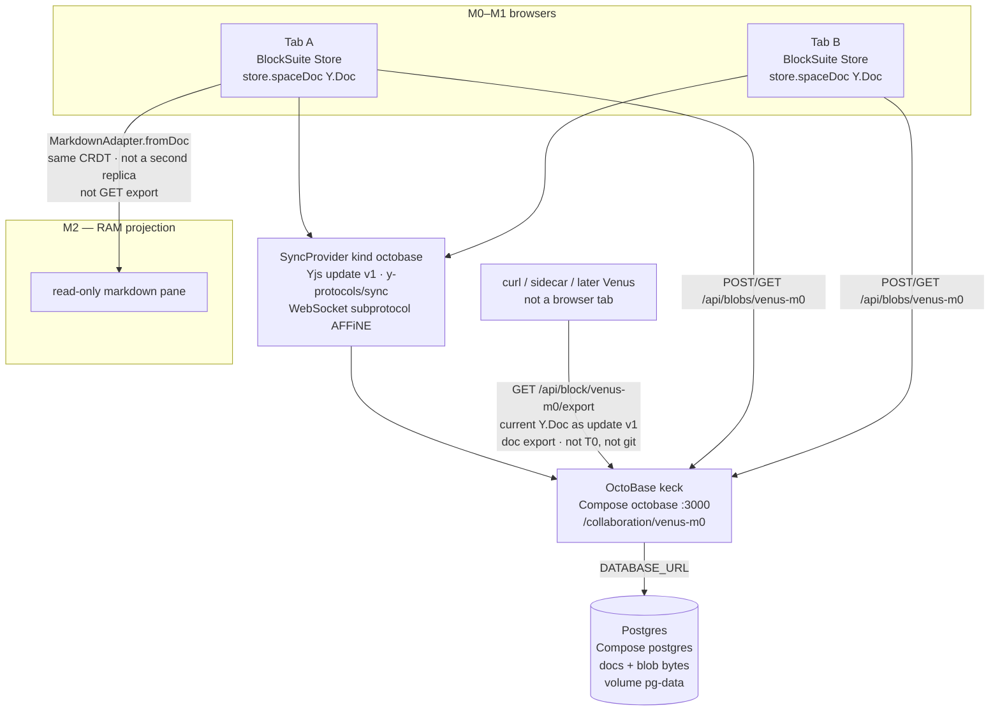

# Architecture

How Venus’s pieces connect. **Product rules** (lease, freeze, two git classes) stay in [venus-design.md](./venus-design.md). **Stores:** [datamodel](./datamodel/README.md). This file is the **dataflow**: who talks to whom. Markdown hangs off the synced Store ([projection](#markdown-projection-add-here-before-coding-m2)).

Words: [glossary.md](./glossary.md). Prototype CRDT stack: [CRDT/README.md](./CRDT/README.md). Installed names: [api-map.md](./api-map.md). How we test each box: [scenarios](../scenarios/README.md).

## Layers (now vs later)

| Layer | Status | Design |
|---|---|---|
| Editor + outline | **M0 done** | [M0](./M0/README.md) |
| Sync, persist, blobs, **doc export** | **M1 done** | [CRDT](./CRDT/README.md), [M1](./M1/README.md) |
| Markdown projection | **M2 done** | [MDGate](./MDGate/README.md), [M2/plan.md](./M2/plan.md) |
| Pin + git snapshotter | Later (M3) | [LiveSnapshot](./LiveSnapshot/README.md) |
| LifeIndexing | Parallel (after M3) | [Agents](./Agents/README.md) — [AB1](./Agents/agentic-binding.md#ab1--lifeindexing) / [LifeIndexing](./Agents/LifeIndexing.md) |
| Bound chat | Parallel (after AB1; **ask-only**) | [AB2](./Agents/agentic-binding.md#ab2--bound-chat) |
| Chat-edit markdown | Parallel (**after M5–M6 checkout**, not after AB2) | [AB3](./Agents/agentic-binding.md#ab3--chat-edit-markdown) |
| History / why pack | Parallel (**after M6**; needs AB1 index; not after AB1) | [AB4](./Agents/agentic-binding.md#ab4--history--why-pack) |
| Catalog / header | Later | M4 |
| Lease `T0` + freeze | Later | [lease-freeze-rationale.md](./lease-freeze-rationale.md) |
| Stores (CRDT + git) | Design | [datamodel](./datamodel/README.md) |

## Dataflow (M0–M2)




Stock **`y-websocket` is not on this diagram.** M1’s wire is keck + `AFFiNE`. The `SyncProvider` kind still lists `'y-websocket'` so cloud can swap the **server** later without rewriting `mount-editor`. Persist stays Postgres. See [CRDT](./CRDT/README.md#seam).

Compose **`web`** (nginx on `:8080`) is a same-origin reverse proxy in front of the same keck. It is not a fourth store. Vite `pnpm dev` still opens WS to `:3000` and proxies `/api`. How the containers run: [devops/compose](../devops/compose.md).

## Elements

Each row is a box that later markdown (or git) can hang off. Do not put review hunks on the published tree ([datamodel](./datamodel/README.md)).

| Element | What it is | Markdown later | How we test |
|---|---|---|---|
| **Host** | Vite + React. Mounts BlockSuite web components. | Layout for a read-only md pane (M2). No caret. | [Editor host](../scenarios/editor-host.md) |
| **BlockSuite Store** | Live published page. `affine:*` tree. | Adapter input. Sidecar ids on export. | [Editor host](../scenarios/editor-host.md), [hydrate](../scenarios/hydrate-persist.md) |
| **Y.Doc** | `store.spaceDoc`. Client CRDT. | Never a second Y.Text of the `.md`. | [Hydrate](../scenarios/hydrate-persist.md), [collaboration](../scenarios/collaboration.md) |
| **SyncProvider** | Seam in the host. | Unchanged. Md pane reads the **synced** store. | [Sync seam](../scenarios/sync-seam.md) |
| **keck** | WS front + blob HTTP + **doc export**. AGPL container. | Lease/git sidecar calls **export**, then adapter. | [Collaboration](../scenarios/collaboration.md), [blobs](../scenarios/blobs.md), [doc export](../scenarios/doc-export.md) |
| **Postgres** | Source of truth for refresh. Docs + blobs. | Not a markdown store. | [Hydrate](../scenarios/hydrate-persist.md), [blobs](../scenarios/blobs.md) |
| **Compose web** | nginx + static host. Proxies `/api` and `/collaboration` to keck. | Layout only. | [Compose stack](../scenarios/compose.md) |
| **Doc export** | `GET /api/block/venus-m0/export`. Current tree, no tab. | Same GET becomes `T0` bytes (M5) and optional `.venus/snapshots/*.bin`. | [Doc export](../scenarios/doc-export.md) |
| **Markdown projection** | Adapter output + RAM id sidecar. | **M2 done.** [plan](./M2/plan.md). | [Markdown projection](../scenarios/markdown-projection.md) |
| **Git** | Folders + `.md` + commits. | Snapshot vs comment-commit. Layout: [datamodel git](./datamodel/git.md). Pin then convert: [LiveSnapshot](./LiveSnapshot/README.md). M3+. | None yet. |
| **Review session** | Lease, threads, hunks. Per commit Before/After **OctoBase CRDTs**. | Comment-commits vs `T0`. After editable; edits are the next commit. M5–M6. | None yet. |

## Markdown projection (add here before coding M2)

M2 hangs **one** new arrow off the **synced Store**, not off keck export:

```text
WYSIWYG (live CRDT)  ← aligned →  read-only markdown pane
                         │
                         MarkdownAdapter.fromDoc
                         + block-id sidecar
```

- Markdown is a **projection**, not a replica ([venus-design.md](./venus-design.md)).
- One exporter later serves the pane, git flush, and lease `T0` md ([implementation plan — adapter gate](./venus-implementation-plan.md#markdown-adapter-gate-build-this-do-not-debate-it)).
- Non-browser jobs still use **doc export** for the binary, then the same adapter. Git flush **pins** those bytes (or a sidecar replica) **before** `fromDoc`; live CRDT is not paused ([LiveSnapshot](./LiveSnapshot/README.md)).
- Spectator loop (single-flight; in-place splice or full `fromDoc`): [live-pane.md](./MDGate/live-pane.md). Git / lease convert: [pin-convert.md](./MDGate/pin-convert.md) (pin Yjs bytes, then `fromDoc` on an offline clone).

**M2 closed** when [fixtures.md](./MDGate/fixtures.md) **export** rows are green ([M2/plan.md](./M2/plan.md), 2026-08-30). `fromDoc` + pane loop: [MDGate](./MDGate/README.md). Apply (markdown vs `T0` → hunks): [apply.md](./MDGate/apply.md); **apply** fixture rows before M6.

## Cross-references

| Need | Where |
|---|---|
| Stores (CRDT + git) | [datamodel](./datamodel/README.md) |
| Why freeze, two git classes | [venus-design.md](./venus-design.md) |
| Yjs wire, keck, Postgres, export | [CRDT/README.md](./CRDT/README.md) |
| Pins and curl | [api-map.md](./api-map.md) |
| M1 steps | [M1/plan.md](./M1/plan.md) |
| M2 steps | [M2/plan.md](./M2/plan.md) |
| Compose / Kubernetes | [devops](../devops/README.md) |
| Adapter gate (M2) | [MDGate](./MDGate/README.md), [subset](./MDGate/subset.md), [fixtures](./MDGate/fixtures.md), [live pane](./MDGate/live-pane.md), [pin convert](./MDGate/pin-convert.md), [M2/plan.md](./M2/plan.md) |
| Apply (M6) | [MDGate apply](./MDGate/apply.md) |
| Pin + git snapshotter (M3) | [LiveSnapshot](./LiveSnapshot/README.md); **gated on** [high-availability.md](./LiveSnapshot/high-availability.md) **Acceptance** |
| LifeIndexing / bound chat | [agentic-binding](./Agents/agentic-binding.md) (AB1–AB4). Contract: [LifeIndexing](./Agents/LifeIndexing.md) (spatial + temporal). |
| Implemented tests | [scenarios](../scenarios/README.md) |
| License split | [licensing.md](../legal/licensing.md) |
