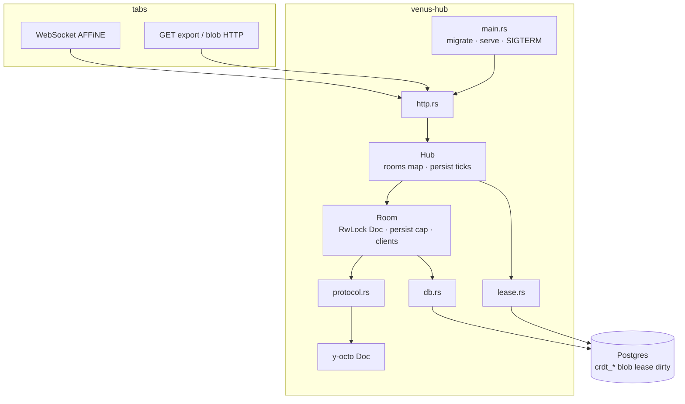

# Hub software architecture

How **this process** is built. Venus-wide dataflow (tabs ↔ hub ↔ Postgres) stays in [architecture.md](../../../architecture.md). Scale / owner / dirty contract: [M3.0 HA](../../../M3.0/high-availability.md). Crate map: [files.md](./files.md). How to run: [README.md](./README.md). **Memory caps vs working set:** [Memory](#memory-caps-not-working-set).

Crate `venus-hub`: one **library** (`src/lib.rs`) + one **binary** (`src/main.rs`). Runtime is **Tokio** (`rt-multi-thread`). HTTP and WebSocket are **Axum 0.8** (`ws` → tokio-tungstenite). Apply engine is **y-octo 0.1.0**. Not Socket.IO, not actix, not a Node `ws` server. Persist is opaque `BYTEA` — the hub does **not** walk CRDT items (that was keck’s `Format` panic class).

[M3.0 `step-ws`](../../../M3.0/plan.md#3-step-ws) is the merge buffer: two clients share one RAM doc over `AFFiNE`; persist drains ~1s into step-2 tables. Compose as the product path is the next step.

## Layers

Top to bottom, one request never skips a layer:

```text
http.rs          Axum: POST health, AFFiNE WS upgrade, blob REST, export. No CRDT logic.
room.rs          Hub + Room: apply queue, fan-out, persist buffer.
protocol.rs      y-protocols frames (tags 0–3) + apply_v1 / encode_v1.
y-octo           RAM Doc (update v1). Same family as browser yjs@13.6.32.
db.rs            SQL: hydrate, flush, compact, blobs. schema.sql at migrate.
lease.rs         workspace_lease: one live owner per workspace_id.
Postgres         Product store. No SQLite.
```

`config.rs` and `blobs.rs` are helpers (env DSN; BlockSuite `sha()` hash). They are not a second stack.



## Process lifecycle

`main` does not apply updates. It wires the process and then serves:

1. Read [config](./files.md#configrs) (`POSTGRES_*` / `DATABASE_URL`, `POSTGRES_SSLMODE`, listen, owner, required `HUB_DB_*` / `HUB_PERSIST_INTERVAL_MS` / `HUB_COMPACT_AFTER`, `HUB_CORS_ORIGINS`). Startup logs `pg_sslmode`, pool/timer knobs, and CORS origin count, not the DSN.
2. `db::connect_with` + `db::migrate` (`schema.sql` on one connection under a session advisory lock; trigger DDL only if any STATEMENT dirty trigger is missing).
3. `Lease` + `Hub` (shared `PgPool`, persist interval and compact after from env).
4. Bind `HUB_LISTEN`. Spawn `Hub::heartbeat` every `lease_ttl / 3` (default 6s) (`MissedTickBehavior::Delay`, same as persist). `Config` refuses `ttl < 3 × interval`. A miss (stolen or missing row) **sheds** the RAM room: remove from `rooms`, `request_stop`, leftover flush, drop client senders. Do not `try_acquire` from shed. Idle rooms (no clients, empty persist buffer, idle ≥ lease TTL) get the same shed plus `lease.drop_one`.
5. `axum::serve` with graceful shutdown on SIGINT / SIGTERM.
6. After serve returns (including `Err`): abort the heartbeat task, then `Hub::shutdown` — set `stopping` so `get_room` cannot re-lease, notify persist tasks, last flush, join (timeout), `rooms.clear()`, `DELETE` this owner’s `workspace_lease` rows, then exit.

Crash without the signal path can lose ≤ one persist batch (~1s). Same as keck.

## Three pipes (keep them separate)

Same split keck had. Do not glue them back inside `handle_binary`.

1. **Apply** — WS binary → `decode_sync_messages` → `apply_update_from_binary_v1` on that room’s `Doc`. One `RwLock<Doc>` **per room**, not per socket: hello, export, and Step1 share a read; only apply writes. Empty / all-zero updates are skipped (`is_noop_update`). Apply errors are logged; the process does not panic. A truncated batch logs `offset` / `remaining` once and still applies the prefix.
2. **Broadcast** — wrap the **incoming** update as `DocMessage::Update` (`Bytes`) and send to other sockets on that room. Origin is not echoed. Fan-out clones the `Bytes` handle, not the payload.
3. **Persist** — push the same bytes onto a per-room buffer (`PERSIST_BYTES` = 8 MiB; over cap drops **oldest** bins and logs). A background task every **~1s** writes the whole buffer as **one** `INSERT` into `crdt_update`, or immediately on SIGTERM (`Notify`). Compact (merge trail into `crdt_snapshot`, delete merged seqs) runs on that timer when `trail_len ≥ 32`, **not** inside the insert. The merge itself is off the exclusive lock: hydrate is not blocked on `encode_v1`. Not a persist task per socket.

Tests: `cargo test -p venus-hub --test ws` (hub + Postgres; no keck).

Live collab never waits on markdown, git, or pin convert. Persist is never paused for a pin.

## Room as the unit of concurrency

M3.0 is **one Y.Doc per room at open** (home). Path `/collaboration/:workspace_id` is a UUID (M0 wiki is UUID v5 of `venus-m0`). Bare WS is the page `spaceDoc` (BlockSuite guid `doc:home`). SQL `doc_id` is UUID v5 of `doc:home`. Extra docs: **`?doc=<sql uuid>`** on that path ([M4 wire A1](../../../M4/plan.md#spaces-and-git)). The **lease grain stays `workspace_id`**.

```text
Hub
  pool, lease, compact_after, stopping
  rooms: Mutex<HashMap<workspace_id, Arc<Room>>>
  hydrating: in-flight get_room by workspace_id (waiters get Arc<Room>)
  exporting: in-flight cold live_export by workspace_id (waiters get bytes)

Room  (one per workspace_id this process owns)
  RwLock<Doc>                   apply queue (reads share; apply writes)
  persist: PersistBuf            Vec<Bytes>, 8 MiB cap; drop oldest (P15 clone is refcount)
  persist_task                 JoinHandle for this room’s persist loop
  trail_len                    flushed `crdt_update` rows not yet compacted
  last_empty                   when clients last became empty (P6 idle)
  clients: HashMap<id, Outbound>  256 slots + 1 MiB queued; Full / over-budget → detach
```

`Hub::get_room`:

1. If `stopping`, return `Store("hub is shutting down")` before any lease (L19).
2. Return the existing `Arc<Room>` if present.
3. Else join an in-flight hydrate for that `workspace_id`, or become the leader (one `try_acquire` + `db::hydrate_with_trail_len`). Followers do not hydrate. Do not hold `Hub.rooms` across hydrate. If hydrate fails, or stopping is set after acquire, the leader `drop_one`s the lease it just took — a workspace with no room must not stay owned, or retries renew it and the other hub 503s forever.
4. Leader inserts `Room::with_trail_len` and spawns that room’s persist loop onto the `Room` (still under the `rooms` lock so shutdown cannot miss the handle). Persist: `flush`, then `compact_if_needed` only if `trail_len >= compact_after`.

`Hub::live_export`: if the room is in RAM, clone the `Arc<Room>`, drop `rooms`, then `encode_live` (no flight — concurrent RAM encodes are OK). Cache miss joins or leads `Hub.exporting` (same waiter shape as `hydrating`, bytes not `Arc<Room>`), re-checks RAM, then one `db::default_page_export` for all waiters. Export of a large doc does not block `get_room`.

A second process that loses the lease never opens a RAM doc for that wiki. WS upgrade then returns **503** (`GetRoomError::Held`). Hydrate or Postgres failure is **500**, not a fake lease conflict.

## Handshake and message flow

Product path is **Axum WebSocket** (`http::handle_socket`), not an in-process `Room` only. Subprotocol **`AFFiNE`**. `POST /collaboration/:workspace_id` is health JSON (`{"protocol":"AFFiNE"}`) and does **not** take a lease. `GET` without `Upgrade: websocket` returns the same JSON. `GET` with upgrade calls `Hub::get_room` then `ws.protocols(["AFFiNE"])`. Lease held by another hub → **503**. Store/hydrate failure → **500**. A `{workspace_id}` that fails the slug check → **400** (no lease).

On accept (`Room::attach`), four binary frames (same shape the M1 client expects; it already sends Doc **Step1** on `open`):

1. Auth ok (`SyncMessage::Auth(None)`).
2. Empty **awareness** (`encode_awareness_empty`).
3. Doc **Step1** (our state vector).
4. Doc **Step2** (full `encode_update_v1` so the client can mark `synced`).

`attach` encodes those frames **before** inserting the client. Encode failure never leaves a sender in the map.

Then a select loop: socket binary → `Room::handle_binary`; outbound mpsc → socket binary. A full or over-budget outbound queue detaches that client (`try_send`); they reconnect for a fresh Step2. Server ping every 30s (`ws_ping = 0` disables without panicking); missed pong (10s) closes the socket. Client ping/pong stay at the HTTP layer. Origin is not echoed. Apply errors are logged; the process does not panic (Format/bold is a Yjs update v1, not a history stringify).

| Incoming | Room does |
|---|---|
| Doc Step1 | Diff encode (`encode_state_as_update_v1`); fallback full encode → Step2 to that socket |
| Doc Step2 / Update | Apply + persist push + Update fan-out |
| AwarenessQuery | Empty awareness to that socket |
| Awareness / Auth | Ignore |

Two sockets on the same room: A’s Update is visible to B without reload (order of ~200ms is ok). After a write, the persist tick (~1s; tests wait **≥2s**) `INSERT`s `crdt_update`. Restarting **this process** (Postgres stays) hydrates a new client from SQL, not RAM. Compose `restart hub` without `-v` is proven in [step-compose-hub](../../../M3.0/plan.md#4-step-compose-hub).

## RAM vs SQL

| State | Where | Lost on crash? |
|---|---|---|
| Live `Doc` | Room `RwLock` | Yes, except what was flushed |
| Unflushed updates | Room persist buffer (≤ 8 MiB) | Yes, ≤ ~1s; over cap drops oldest |
| Durable CRDT | `crdt_snapshot` + `crdt_update` | No |
| Blobs | `blob` | No |
| Owner | `workspace_lease` | Dropped on SIGTERM |
| Dirty mark | SQL trigger on persist | Not a hub `INSERT` |

`Hub::live_export` (gRPC `ExportDoc`) prefers the live RAM encode if this process has the room; otherwise one SQL snapshot + trail encode shared by concurrent waiters on that `workspace_id`. GET `/api/block/:id/export` does **not** encode; it returns advertisement JSON.

`GET`/`HEAD /api/blobs/:id/:hash` send `Cache-Control: public, max-age=31536000, immutable` and a quoted `ETag` of the hash. Matching `If-None-Match` answers **304** after `blob_len` (existence only); a missing hash is **404**, not 304.

## Memory (caps, not working set)

Every MiB figure below is a **ceiling**. Attach does not allocate it. A healthy replica’s RSS is the live `Y.Doc`s it owns, plus a second of unflushed typing, plus whatever WS/HTTP bodies are in flight. Budget `rooms × 8 MiB` or `clients × 1 MiB` only as the OOM bound you cut off, not as expected RAM.

Two bills: **this process** (Compose hub `mem_limit: 1g`) and **Postgres backends this replica’s pool opened** (`HUB_DB_WORK_MEM`). Wiki count hits the hub, and only for rooms still live here. Connection count hits Postgres. Constants: `WS_MAX_MESSAGE` / `OUTBOUND_BYTES` / `PERSIST_BYTES` in `http.rs` / `room.rs`; compile-time `assert`s keep both byte budgets ≥ one max WS frame.

### In this process

| Buffer | Grain | Cap | Typical | When it fills |
|---|---|---|---|---|
| Live `Y.Doc` | room (`workspace_id`) | none (doc size) | the page | for as long as this replica owns the wiki |
| Persist queue | room | `PERSIST_BYTES` **8 MiB** | ~1s of typing, often hundreds of bytes; **0** if idle | paste, persist tick behind, Postgres down |
| Outbound WS queue | **client** | `OUTBOUND_BYTES` **1 MiB** (256 slots) | **0** (caught-up tab) | peer slower than apply; detach over budget |
| Inbound WS frame | one read | `WS_MAX_MESSAGE` **512 KiB** | one update | the message, then gone |
| Blob POST body | one POST | **32 MiB** | the upload | the request, then gone |

**Live document.** One `RwLock<Doc>` per wiki this process owns. Uncapped by a constant: a fat wiki is whatever y-octo holds. Hello, export, and compact each encode a full snapshot as a **temporary** extra copy, then drop it. This is the RAM that actually stays. It does not grow with `HUB_DB_MAX_CONNECTIONS`.

**Persist (`PERSIST_BYTES`).** Unflushed CRDT bins waiting for the ~1s SQL flush — **not** the live doc, not per tab. Apply pushes the same `Bytes` onto this queue and onto fan-out. The persist task `INSERT`s the batch and drops that prefix. Over cap it **drops oldest** (loudly) and keeps newest; the in-flight prefix of a flush is not dropped (a successful `INSERT` must not mismatch on retry). A live idle room (someone connected, not typing) sits at **zero persist bytes**. With inbound at 512 KiB, 8 MiB is ~16 max-size frames of backlog (SQL-failure headroom), not “two max frames.”

```text
hub persist RAM ≤ live_rooms × 8 MiB     # only if every room is stuck at the cap
```

**Outbound (`OUTBOUND_BYTES`).** Already-framed updates waiting to be written to **that** WebSocket. Apply never `.await`s a slow reader: `try_send` queues or detaches (reconnect gets a fresh Step2). Clone is a `Bytes` refcount: ten tabs queued on the same paste share one allocation; the per-client counter still charges each budget. 1 MiB is two max frames so a 512 KiB paste plus a bit of follow-on does not immediately kick a slightly lagging peer.

```text
hub outbound RAM ≤ clients × 1 MiB      # only the sockets that are actually behind
```

**Idle eviction.** No clients, empty persist, idle ≥ lease TTL (20s) → shed RAM, `lease.drop_one`. Thousands of unused wikis cost this replica almost nothing; the next tab hydrates from SQL.

**Transient.** One WS frame ≤ 512 KiB, one blob POST ≤ 32 MiB. They scale with overlapping requests (why the pool is 32), not with wiki count. Pool sockets in the hub process are small; the 16 MiB `work_mem` is **not** allocated here.

### Postgres, charged to this replica

`work_mem` is a per-backend, per-node ceiling **inside Postgres**. The hub sets it on every pooled session (`after_connect`, `HUB_DB_WORK_MEM`). Compose: 32 × 16 MiB.

```text
Postgres RAM attributable to one hub replica
  ≤ HUB_DB_MAX_CONNECTIONS × HUB_DB_WORK_MEM
  = 32 × 16 MiB = 512 MiB     # ceiling, taken lazily, released at statement end
```

Idle pool connections do not hold 16 MiB. The spend is a cap-sized `unnest($3::bytea[])` flush (persist buffer at 8 MiB). Typing batches never spill. Wiki count does not appear in the product: ten thousand wikis still flush through the same 32 backends. A **second hub replica** adds another 32 × 16 MiB of worst-case Postgres — fleet math is `replicas × pool × work_mem` ([hub-fleet.md](../../../../devops/hub-fleet.md#memory-budget-as-replicas-grow)). Do not set `work_mem` on the role or in `postgresql.conf` (snapshotters and exports would inherit it).

`shared_buffers`, WAL, and table cache are server-wide. `dirty` rows are two UUIDs + a bigint + a timestamp on disk, not a hub buffer. The trigger’s `NEW TABLE` copy lives for one flush statement inside a backend.

### How to read a scale-out

| You add | This replica’s hub RAM | Postgres `work_mem` for this replica |
|---|---|---|
| Workspaces in the product | no extra until someone opens them **here** | none |
| Live wikis **this pod owns** | `Y.Doc` + up to 8 MiB persist each | none (same 32 backends) |
| Tabs on those wikis | + up to 1 MiB outbound each (shared frames) | none |
| `HUB_DB_MAX_CONNECTIONS` | pool sockets (small) | × `HUB_DB_WORK_MEM` ceiling |
| Hub replicas (HPA) | each pod: only *its* rooms | another `pool × work_mem` on the shared server |

Do not tune `work_mem` to fix a hub OOM — that is live docs and stuck persist queues. Do not raise persist/outbound caps to “need 8 MiB per room”: those figures are the drop/detach bound.

## What this architecture refuses

| Refused | Where it lives instead |
|---|---|
| Block REST children / flavour | Opaque Yjs binaries |
| `jwst-rpc` / OctoBase clone | Not linked. [files.md](./files.md) |
| `fromDoc` / `toDoc` / git / `jobs` | M3 worker beside the hub |
| Rust in the editor | [CRDT/wasm.md](../../../CRDT/wasm.md) |
| SQLite product store | Startup error |
| Per-socket persist tasks | One persist buffer per room |
| Compact on every `INSERT` | Background, count threshold 32 |
